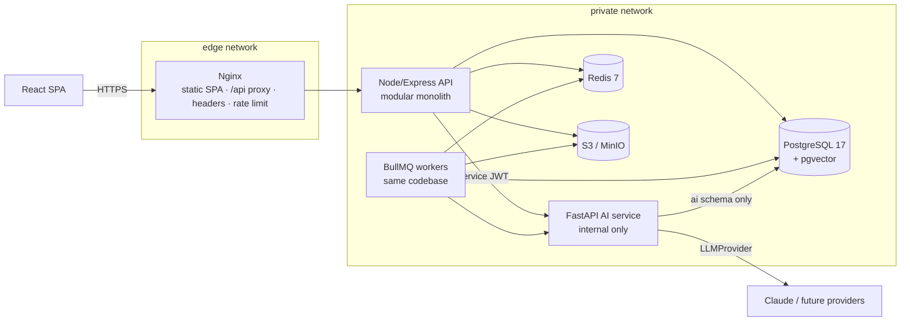

# HealthBridge Architecture

> **Status:** Approved 2026-10-01, with amendments (§2). The full original proposal, with
> ER diagrams, data flows, the API module list and the roadmap, is in
> [ARCHITECTURE_PROPOSAL.md](ARCHITECTURE_PROPOSAL.md). This document is the canonical
> summary and is kept up to date as milestones land. Decisions are recorded as ADRs in
> [DECISIONS.md](DECISIONS.md).

**Positioning:** *Consult your trusted local doctor first. Visit only when necessary.*
HealthBridge optimises for **continuity of care** with doctors patients already trust,
not for doctor discovery.

## 1. System overview



| Component | Responsibility |
|---|---|
| **Nginx** (`web` container) | Serves the SPA. Proxies `/api/` only. Sets security headers for static responses. Edge rate limiting. Health and metrics endpoints are **not** proxied. |
| **API** (`backend/`) | REST `/api/v1`. All business rules, authorisation, consent, transactions and audit. The sole schema-migration authority. |
| **Workers** (`backend/`, from M1/M4) | Outbox relay, document pipeline orchestration, notifications, reminders. |
| **AI service** (`ai-service/`) | OCR, classification, extraction, retrieval and bounded agents. Writes **AI artifacts only**. Never exposed publicly. |
| **PostgreSQL** | The system of record. Schemas: `public` (core), `ai` (AI artifacts), `audit` (append-only). |
| **Redis** | Queues (BullMQ), rate limiting, cache, WebSocket fan-out. Nothing that cannot be rebuilt. |
| **Object storage** | Original medical documents (quarantine → validated). Presigned, short-lived, audited access. |

## 2. Core invariants (approved amendments)

1. **AI proposes → backend validates → backend commits** ([ADR-0004](adr/0004-ai-proposes-backend-validates-commits.md)).
   - AI never directly modifies prescriptions, clinical notes, diagnoses, appointments,
     consent or medical records.
   - AI output first exists as an artifact carrying source, confidence/validation state,
     model, timestamp and request/run ID.
   - Enforced in the database: the AI role has no privileges on core tables.
2. **Transactional outbox** ([ADR-0005](adr/0005-transactional-outbox-bullmq.md)).
   - The domain change and its outbox event are written in one transaction, then relayed
     outbox → BullMQ.
   - A Redis failure never loses an event. Consumers are idempotent.
3. **Three-gate access control** ([ADR-0006](adr/0006-layered-access-control-rls-least-privilege.md)).
   - Gates: role permission → resource relationship → active consent, checked at request
     time.
   - `AccessPolicy` is the central service. PostgreSQL RLS and least-privilege roles
     provide defence in depth.
   - Every sensitive read or write is audited.
4. **Provider abstractions** ([ADR-0007](adr/0007-provider-abstractions.md)).
   - Interfaces: `LLMProvider` (Claude first), `VideoProvider` (LiveKit first:
     `createRoom`, `joinRoom`, `endRoom`, `participantStatus`), `PaymentProvider`
     (Razorpay first).
   - Domain code never imports a vendor SDK.
   - An appointment is never marked paid based on frontend state. Webhooks are verified,
     deduplicated and idempotent.
5. **LLM and PHI policy** ([ADR-0008](adr/0008-llm-usage-and-phi-policy.md)).
   - Synthetic data only in development.
   - Logs carry AI metadata only, never medical content.
   - Production with an external LLM is blocked in code until
     `LLM_EXTERNAL_PROCESSING_APPROVED=true` is set after a privacy, security and
     compliance review.
   - Removing names or IDs alone is not considered sufficient de-identification.
6. **Immutable signed clinical records** ([ADR-0009](adr/0009-immutable-clinical-records-versioning.md)).
   - Corrections follow original → correction version → new authoritative version.
     Records are never silently mutated.
7. **Source grounding and patient-scoped RAG** ([ADR-0010](adr/0010-source-grounded-extraction-patient-scoped-rag.md)).
   - Every extracted field carries its value, source document ID, quote and status.
   - Ungrounded values are not trusted. Handwritten documents require clinician review.
   - No global record search. Every claim cites a source; otherwise the answer is
     *"Insufficient information. Please consult the doctor."*
8. **Bounded agents** ([ADR-0011](adr/0011-bounded-workflow-agents.md)).
   - Predefined, mostly deterministic workflows.
   - No autonomous diagnosis, prescribing, treatment changes or emergency decisions.
9. **AI observability** ([ADR-0012](adr/0012-ai-execution-records.md)).
   - Every AI execution records run ID, workflow, agent, provider, model, timing, tokens,
     estimated cost, status, error, source IDs and output validation status.
   - Raw sensitive prompts and responses are not stored.

## 3. Backend layering

```
routes → controllers → application services → domain (pure rules) → repositories → PostgreSQL
                                   └→ policies (AccessPolicy) · adapters (storage, payments, video, AI, notify)
```

| Layer | Location | Rule |
|---|---|---|
| API | `src/api`, `modules/*/routes.js`, `controller.js`, `schemas.js` | HTTP only: validate (Zod), call a service, shape the response |
| Application | `modules/*/service.js` | One use case, owns the transaction, writes outbox events |
| Domain | `modules/*/domain/` | Pure functions and state machines, no I/O |
| Infrastructure | `modules/*/repository.js`, `src/core/*` | SQL (Knex, parameterised), vendor adapters |

**Request pipeline:**

1. request ID
2. structured access log (path only)
3. metrics
4. helmet
5. health routes (internal)
6. CORS allowlist
7. Redis rate limit
8. JSON body (100 KB)
9. route: validate → authorise → controller
10. 404
11. RFC 9457 problem+json error handler (no internals leak)

## 4. Data and security baseline (in place from M0)

- **Roles:**
  - `hb_owner` (migrations only);
  - `hb_app` (backend: DML on `public`, SELECT/INSERT only on `audit`, no DDL, no RLS
    bypass);
  - `hb_ai` (AI service: `ai` schema only).
  - `CONNECT` is revoked from `PUBLIC`.
- **Extensions:** `pgcrypto`, `citext`, `btree_gist`, `pg_trgm`, `vector`.
- **Logging hygiene:**
  - request paths are logged without query strings;
  - auth headers, cookies and tokens are redacted;
  - medical content is never logged.
- **Network:** all host ports bind to `127.0.0.1`. The AI service has no published port.
  The web container is not on the data network.

## 5. Domain model and patient-scoped authorization (M2)

- **Identity, health profile and professional profile are separate.**
  - `users` authenticate.
  - `patients` hold the health profile; dependents may have no login.
  - `doctors` hold the professional profile.
  - `doctor_verifications` hold the credential review.
- **Continuity:** `care_relationships` ("My Doctors") follow the lifecycle
  INVITED/PENDING → ACTIVE ⇄ PAUSED → ENDED. Only ACTIVE confers treating access.
- **Dependents:** explicit guardianships (actor → relationship → dependent), each with an
  access scope and a basis. Family ties alone grant nothing.
- **Clinics:** many-to-many with doctors and administrators. Clinic roles are scoped per
  clinic and in force only with an active membership. Membership never grants patient
  access.
- **Authorization:**
  - AccessPolicy applies the three gates.
  - Relationship resolvers live in `modules/care-access`.
  - The interim consent basis is an active care relationship, for reading the profile only.
  - PostgreSQL RLS on patient-scoped tables is an independent second layer
    ([ADR-0017](adr/0017-patient-scoped-authorization-rls.md)).
  - DOCTOR and CLINIC_ADMIN are workflow-granted
    ([ADR-0018](adr/0018-doctor-verification-workflow-granted-roles.md)).

### Scheduling (M3)

- Doctors publish weekly availability. Slots are computed on demand.
- Two PostgreSQL `EXCLUDE` constraints guarantee no doctor or patient double booking.
- Booking requires an active care relationship.
- Paid slots create 15-minute holds, paid for through M4 payments.
- The reason for visit lives in an RLS-protected intake table, visible to the patient and
  the doctor only.
- Clinic staff work with booking references, not patient identity.
- Every change writes an audit row and an outbox event in one transaction
  ([ADR-0019](adr/0019-scheduling-on-demand-slots.md)).

### Payments, outbox and workers (M4)

- Payments run through `PaymentProvider`: Razorpay in production, a deterministic fake
  for development, tests and demo (refused in production).
- **Only a verified provider webhook marks a payment paid.** It confirms the appointment
  through the system-only `confirm_payment` transition.
- Webhook events are deduplicated by provider event ID and by payload digest.
- `ledger_entries` is append-only; corrections are compensating entries.
- Hold expiry and payment confirmation lock the appointment row first, so they always end
  in one valid state. A capture that arrives after expiry is refunded automatically.
- The worker process (`src/worker.js`, same image) runs:
  - the outbox relay (`FOR UPDATE SKIP LOCKED` → BullMQ, at-least-once, deterministic
    job IDs);
  - the `notifications`, `payments`, `appointments` and `maintenance` queues;
  - database-driven reminders;
  - a PostgreSQL dead-letter table.
- Webhooks and workers use purpose-scoped **system transactions** (`withSystem`), which
  RLS keeps separate from user transactions
  ([ADR-0020](adr/0020-payments-webhook-authority-outbox-workers.md), which also has the
  flow diagrams).

### Consent and medical documents (M5)

- **Consent:** patients and managing guardians grant treating doctors explicit consents.
  Each consent has scopes (profile, view documents, add documents), optional document
  types, a purpose and an expiry, and is manual or tied to one appointment.
  - AccessPolicy checks consent on **every request** (no cache), and RLS repeats the check.
  - Revocation takes effect on the next request.
- **Documents:** metadata lives in PostgreSQL and objects in S3/MinIO behind the
  `DocumentStorage` abstraction.
  - Uploads use presigned POSTs to a quarantine key.
  - The `documents` worker validates size, checksum and magic bytes, scans with a
    `DocumentScanner` (ClamAV; fake in dev and test), and promotes atomically to a
    `records/` key.
  - Downloads are presigned GETs issued after authorisation and expire after 60 s by
    default.
- **Access log:** a patient-facing view of the existing audit trail.
- **Details:** [ADR-0021](adr/0021-consent-medical-documents-secure-access.md), with flow
  diagrams.

### Document intelligence (M6)

- AI processing is opt-in per patient.
- Available documents go from the `documents` worker to the AI service with a
  patient-scope token (one patient and document, 120 s).
- A LangGraph **document agent** with no tools runs text/OCR → classify → extract →
  validate (grounding).
- Grounded proposals, chunks and embeddings are stored in RLS-scoped `ai` tables, with an
  `ai_runs` record per execution.
- The backend commits validated, versioned `document_metadata`.
- Lab values become record data only when a consented treating doctor verifies them
  ([ADR-0022](adr/0022-document-intelligence.md)).

### Medical timeline (M7)

- `medical_events` is a provenance-labelled projection of appointments, documents and
  doctor-verified lab values.
- The `timeline` worker builds it idempotently from outbox events by re-reading the
  sources; it can be rebuilt.
- RLS limits doctors to what their consent (by document type) or their own appointments
  cover.
- Patients can export it as JSON ([ADR-0023](adr/0023-medical-timeline-projection.md)).

## 6. Observability baseline

- Structured JSON logs (pino and Python JSON) with a request ID propagated
  browser → Nginx → API → AI service.
- Prometheus metrics on a separate internal port (`:9464/metrics`), including HTTP latency
  by route template.
- Liveness (`/health/live`) and readiness (`/health/ready`) endpoints.
  - API readiness checks the database, Redis and object storage (critical) and the AI
    service (non-critical, degraded).
  - AI readiness checks the database and the LLM configuration, without making paid calls.
- AI calls emit `llm_call` metadata events (see invariant 9).
- Payment, outbox, queue and notification metrics are exposed on the API (`:9464`) and the
  worker (`:9465/metrics`, with `/health/live`). Labels are low-cardinality enums only.
  - Counters: `payments_created_total`, `payments_succeeded_total`,
    `payments_failed_total`, `payment_webhooks_{received,duplicate,invalid}_total`,
    `refunds_{created,completed}_total`, `outbox_events_{created,dispatched,failed}_total`,
    `queue_jobs_{processed,failed,retried,dlq}_total`, `appointment_holds_expired_total`,
    `notifications_{sent,failed}_total`, `reminders_sent_total`.
  - Latency histograms: payment provider, webhook processing, outbox relay batch, worker
    job, notification provider.
- M5 counters: `document_upload_intents_total`, `document_upload_completed_total`,
  `document_scan_{started,success,failed,rejected}_total`, `document_promoted_total`,
  `document_downloads_total`, `document_access_denied_total`, `consent_granted_total`,
  `consent_revoked_total`, `consent_denied_total`,
  `document_worker_{failures,retries,dlq}_total`.

## 7. Roadmap

Milestones M0–M12 are listed in the [proposal §16](ARCHITECTURE_PROPOSAL.md#16-implementation-order).
Current status: **M7 complete (medical timeline with provenance and export).**
See [SECURITY.md](SECURITY.md), [API.md](API.md) and [DATABASE.md](DATABASE.md).
