# HealthBridge — Architecture Proposal

> **Status:** Approved 2026-10-01 with amendments. See [ARCHITECTURE.md](ARCHITECTURE.md) §2 and [DECISIONS.md](DECISIONS.md). This proposal is kept as the historical design record.
> No code is written until this proposal is approved. Once approved, this document is split into
> `ARCHITECTURE.md`, `SYSTEM_DESIGN.md`, `DATABASE.md`, `AI_ARCHITECTURE.md`, `SECURITY.md`, and `DECISIONS.md`.

**Positioning:** *Consult your trusted local doctor first. Visit only when necessary.*
**Core thesis:** Doctor **continuity**, not doctor discovery. The patient–doctor relationship is a first-class entity in this system.

---

## 0. Requirements Analysis

### 0.1 What actually drives the architecture

| Driver | Architectural consequence |
|---|---|
| **Continuity > discovery** | A `care_relationships` table ("My Doctors") is a core entity, not a side effect of bookings. Doctors can invite existing patients (clinic QR or link), so the platform carries an existing offline relationship online. |
| **PHI everywhere** | Access control is a **domain service** (`AccessPolicy`) that every PHI read goes through. It is not a middleware afterthought. Consent is data, it is checked on every access, and it is audited. |
| **AI assists, humans decide** | AI output is stored apart from clinical truth (`ai_runs`, `document_metadata`). It always carries citations and is marked *unverified* until a clinician confirms it. The AI service **proposes**. The backend **commits**. |
| **Medico-legal records** | Prescriptions and clinical notes are **immutable once signed**. Corrections create new versions (`supersedes_id`). Clinical records are never hard-deleted. |
| **Solo builder, production intent** | A modular monolith plus one independent AI service. Few moving parts, strict internal module boundaries, and clean seams for later extraction. |
| **India-first** | Amounts in paise (INR), IST-aware scheduling stored in UTC, Razorpay-style payments, DLT-registered SMS / WhatsApp, an ABDM / ABHA integration path, and data hosted in an Indian region. |

### 0.2 Non-functional targets (initial, revisable)

| Concern | MVP target |
|---|---|
| API latency (non-AI) | p95 < 300 ms |
| Document processing (upload → timeline) | p95 < 2 min (async) |
| Doctor brief | Generated at booking, refreshed T-30 min and on any new upload |
| RAG answer | p95 < 8 s |
| Availability | 99.5% (single region) |
| Backups | RPO ≤ 15 min, RTO ≤ 4 h (managed PITR in production) |
| Scale assumption | 1–10 clinics, < 10k patients at launch. Designed for ~100× growth through horizontal API/worker scaling, read replicas, and partitioned log tables. |

---

## 1. Final System Architecture

A **modular monolith** (Node/Express API plus BullMQ workers from the same codebase) next to an **independent, private AI service** (FastAPI + LangGraph). PostgreSQL is the system of record, including pgvector embeddings. Redis provides queues, rate limits, cache, and the WebSocket fan-out. S3-compatible storage holds documents.

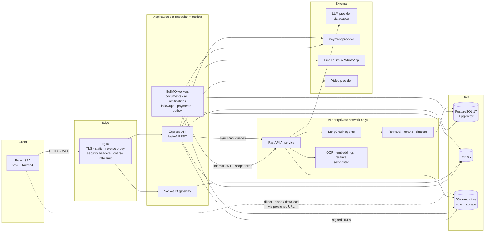

**Architectural principles**

1. **One system of record.** PostgreSQL holds all state. Redis holds nothing that cannot be rebuilt.
2. **The backend owns clinical writes.** The AI service writes only to the `ai` schema (runs, sources, chunks, agent tasks). Anything the AI produces that becomes clinical data passes through backend validation and a transaction.
3. **Async by default for expensive work.** Uploads, OCR, extraction, embeddings, briefs, and notifications run as jobs. The API returns `202 Accepted` with a job or status resource.
4. **Transactional outbox.** Domain events are written in the same DB transaction as the state change, then relayed to BullMQ. A Redis failure therefore never loses an event.
5. **Adapters at every external boundary.** LLM, OCR, storage, payments, video, email, SMS, and WhatsApp each sit behind an interface with a mock implementation for tests and demo mode.

---

## 2. Component Diagram

### 2.1 Backend modules and their dependencies

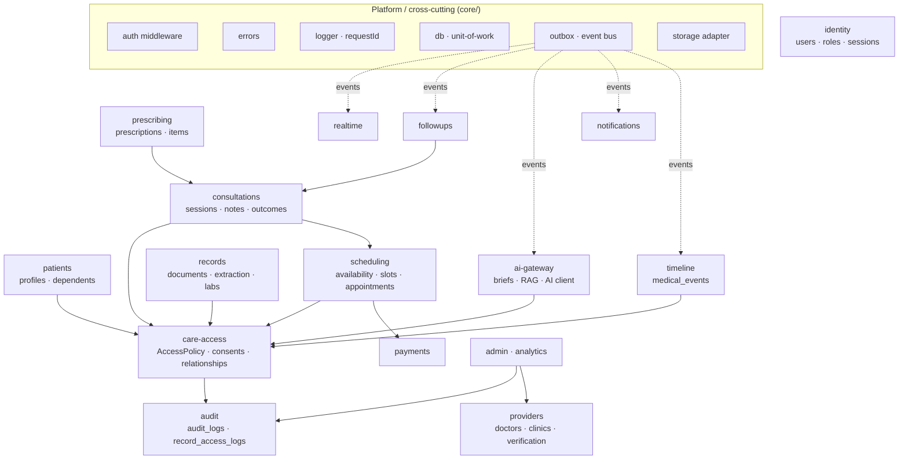

**Boundary rules (enforced by lint rules and code review):**

- A module may call another module's **service** (its public API). It never imports another module's **repository**.
- Cross-module side effects such as "prescription signed → timeline updated → patient notified" travel as **domain events** through the outbox. Direct calls are not used for them.
- Every PHI read goes through `care-access.AccessPolicy`. This is the single choke point for authorisation, consent, and access logging.

### 2.2 Domain events (initial catalogue)

`appointment.booked` · `appointment.confirmed` · `appointment.cancelled` · `consultation.started` · `consultation.completed` · `consultation.outcome_recorded` · `prescription.signed` · `document.uploaded` · `document.processed` · `document.failed` · `followup.scheduled` · `followup.due` · `followup.responded` · `consent.granted` · `consent.revoked` · `payment.captured` · `payment.failed` · `payment.refunded` · `doctor.verified`

---

## 3. Database ER Diagram

**Conventions for all tables**

- `id uuid` primary key, **UUIDv7** generated in the app (time-ordered, so B-tree indexes stay compact).
- `created_at`, `updated_at timestamptz` (`updated_at` maintained by trigger).
- `deleted_at timestamptz` for soft delete on: users, patients, doctors, clinics, medical_documents, and notifications.
- **Clinical records are never deleted:** consultations, clinical notes, prescriptions, lab results, and medical events. They are versioned or superseded instead.
- `is_demo boolean` on root entities (users, patients, doctors, clinics) for demo-mode isolation.
- Money is stored as `bigint` paise plus `currency`.
- Enumerations use `text` with `CHECK` constraints. These migrate more easily than PG enums.
- Schemas: `public` (core), `ai` (AI-owned tables), `audit` (append-only logs).

### 3.1 Identity and access

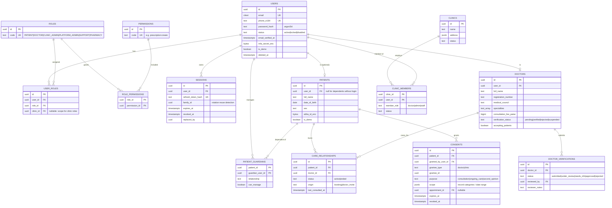

### 3.2 Care delivery

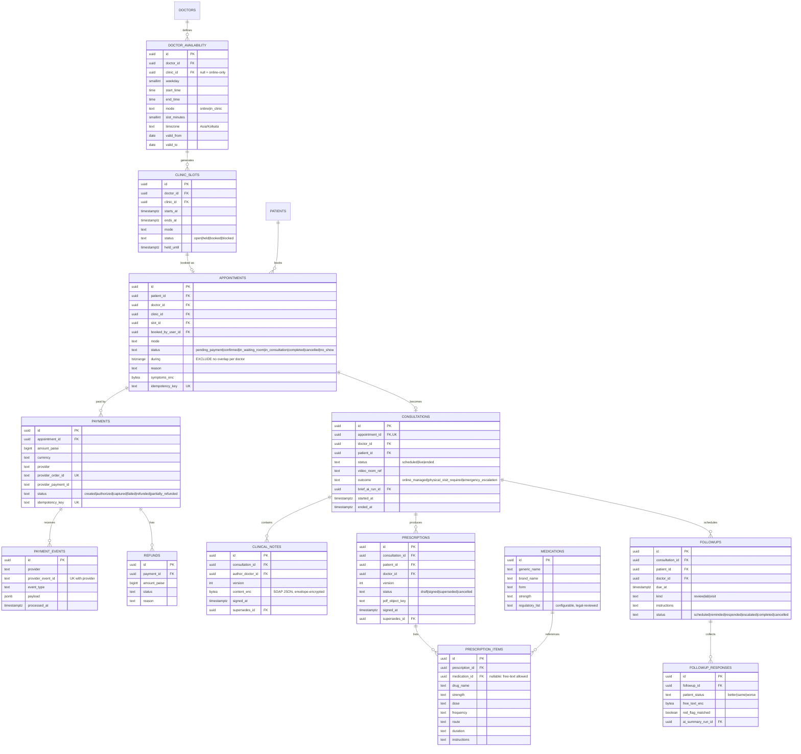

### 3.3 Records, timeline, and AI

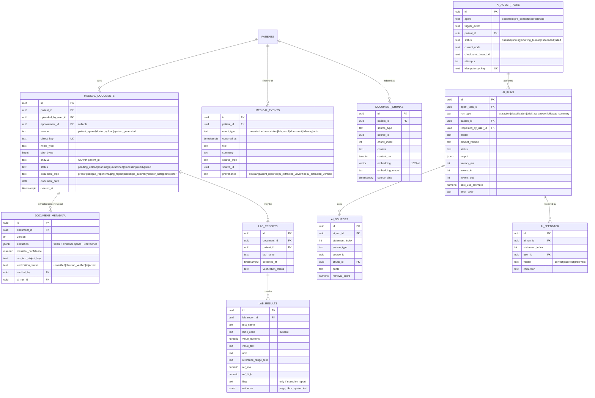

### 3.4 Notifications, audit, and outbox

| Table | Key columns | Notes |
|---|---|---|
| `notifications` | user_id, type, title, body, data jsonb, read_at | The in-app inbox |
| `notification_deliveries` | notification_id, channel, provider, status, attempts, provider_message_id, last_error | One row per channel attempt |
| `notification_preferences` | user_id, channel, event_type, enabled | Opt-outs (never for safety-critical messages) |
| `audit.audit_logs` | actor_user_id, actor_role, action, entity_type, entity_id, before/after (redacted), request_id, ip, user_agent, created_at | Append-only. The DB role has **no UPDATE/DELETE**. Partitioned monthly. |
| `audit.record_access_logs` | actor_user_id, patient_id, resource_type, resource_id, action, purpose, consent_id, decision (allow/deny), request_id | Every PHI read **and every denied attempt** |
| `outbox_events` | aggregate_type, aggregate_id, event_type, payload, created_at, published_at | Relayed to BullMQ by the outbox worker |
| `settlements` | doctor_id, clinic_id, payment_id, gross_paise, platform_fee_paise, net_paise, status | Revenue record |

### 3.5 Integrity rules worth calling out

- **No double booking:** `EXCLUDE USING gist (doctor_id WITH =, during WITH &&) WHERE (status NOT IN ('cancelled','no_show'))` on `appointments` (requires `btree_gist`). Slot rows are also locked with `SELECT … FOR UPDATE` during booking. The exclusion constraint is the last line of defence.
- **Idempotent webhooks:** `UNIQUE (provider, provider_event_id)` on `payment_events`.
- **Idempotent bookings:** `UNIQUE (idempotency_key)` on appointments and payments.
- **Deduplicated uploads:** `UNIQUE (patient_id, sha256) WHERE deleted_at IS NULL`.
- **One live consent per grant:** a partial unique index on (patient, grantee, purpose) `WHERE revoked_at IS NULL`.
- **Timeline index:** `(patient_id, occurred_at DESC)` on `medical_events`.
- **`health_timeline`** is a **view** over `medical_events` joined to source tables, not a duplicated table. The machine-readable export is a JSON endpoint with a FHIR-inspired shape. Real FHIR R4 export is planned for Phase 3.

---

## 4. Frontend Architecture

**Stack:** React 19 + JavaScript + Vite · React Router (data routers) · TanStack Query (server state) · React Hook Form + Zod (forms, with schemas shared through `/shared`) · Tailwind CSS · Radix UI primitives (accessible headless components) · Axios API client · socket.io-client · Sonner (toasts).

```
frontend/src/
  app/                 # bootstrapping: router, providers, query client, error boundary
    routes/            # route tree per role, lazy-loaded
    layouts/           # PublicLayout, PatientLayout, DoctorLayout, ClinicAdminLayout, AdminLayout
    guards/            # RequireAuth, RequireRole, RequirePermission
  features/            # one folder per domain feature (vertical slices)
    auth/  appointments/  doctors/  records/  timeline/  consultations/
    prescriptions/  followups/  consents/  notifications/  payments/
    ai-brief/  ai-assistant/  clinic-admin/  platform-admin/
      api.js           # TanStack Query hooks → services
      components/
      pages/
      schemas.js
  components/ui/       # design system: Button, Input, Card, Dialog, Table, Badge, Skeleton, EmptyState…
  components/medical/  # SourceCitation, AIDisclaimer, ProvenanceBadge, ConfidenceIndicator, TimelineItem
  lib/                 # apiClient (auth + refresh interceptor), socket, formatters (IST dates, INR), logger
  styles/              # Tailwind theme tokens
```

**Key decisions**

- **Token handling:** the access token lives **in memory only**. The refresh token is an `httpOnly; Secure; SameSite=Strict` cookie scoped to `/api/v1/auth`. A silent refresh runs on 401 with request queueing. Nothing sensitive is kept in `localStorage`.
- **Server state lives in TanStack Query**, not Redux. Local UI state uses React state and context. A global store is added only if a real need appears.
- **Role-aware routing.** Each role gets its own layout and navigation.
  - Patient: **Home · Appointments · Health Records · Doctors · Profile**
  - Doctor: **Dashboard · Appointments · Patients · Medical Records · Consultations · Prescriptions · Follow-ups**
  - Clinic Admin: Dashboard · Doctors · Schedule · Appointments · Staff · Billing
  - Platform Admin: Verification queue · Users · Clinics · Appointments · Disputes · Analytics · Audit
- **AI UI contract (non-negotiable).** Every AI-generated block renders with:
  - an `AIDisclaimer`;
  - per-statement `SourceCitation` chips that open the original document or record;
  - a `ProvenanceBadge` (Clinician-entered / Patient-reported / AI-extracted · unverified / Verified);
  - "Mark incorrect" feedback.
- **Accessibility:** WCAG 2.2 AA target, keyboard navigation, visible focus, semantic landmarks, `aria-live` for toasts and status, minimum 4.5:1 contrast, and reduced-motion support.
- **Design language:** white space, a calm teal/blue primary palette, slate neutrals, an Inter type scale, 8-pt spacing, and soft borders instead of heavy shadows. No gradients, gamification, urgency banners, or dark patterns. Light/dark tokens are defined from day one.
- **Resilience:** route-level error boundaries, skeletons for every list and detail view, empty states with a single clear next action, and offline/timeout messaging on uploads.

---

## 5. Backend Architecture

**Stack:** Node 24 LTS · Express 5 · JavaScript (ESM) with JSDoc types + `// @ts-check` in core modules · **Knex** (migrations + parameterised query builder) · Zod (validation) · pino (structured logs) · BullMQ · Socket.IO (Redis adapter) · argon2 · helmet · rate-limiter-flexible.

### 5.1 Layers

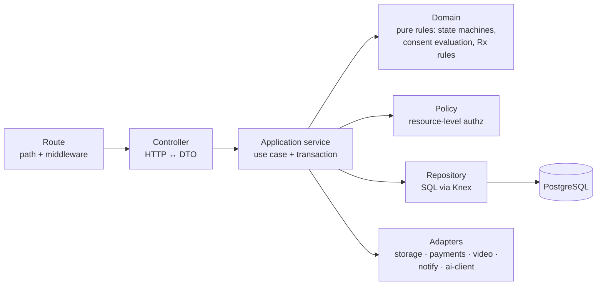

| Layer | Folder | Rule |
|---|---|---|
| API | `routes/`, `controller.js`, `schemas.js` | No business logic. Validate, call the service, shape the response. |
| Application | `service.js` | Orchestrates one use case. Owns the transaction boundary. Emits outbox events. |
| Domain | `domain/` | Pure functions and state machines with no I/O. Unit-tested heavily. |
| Infrastructure | `repository.js`, `core/adapters/*` | SQL and external SDKs only. |

### 5.2 Request pipeline (in order)

`requestId` → `pino-http` → `helmet` → `cors (allowlist)` → `rateLimit (Redis, per IP + per user + per route class)` → `json body (size limit)` → `authenticate (JWT)` → **route** → `validate (Zod: params/query/body)` → `requirePermission('appointment:create')` → controller → service (`AccessPolicy` + resource policy) → repository → `errorHandler` (RFC 7807 `application/problem+json`, includes `requestId`, never leaks stack traces).

### 5.3 Authorisation: three gates

1. **RBAC permission.** Can this role perform this kind of action (`prescription:create`)?
2. **Resource policy.** Is this *specific* resource related to this actor? Examples: the doctor is the consultation's doctor; the clinic admin belongs to the appointment's clinic.
3. **Consent (PHI only).** Does an active, unexpired, unrevoked consent cover this patient, this data category, and this purpose? Patients and guardians are implicitly authorised for their own and their dependents' records.

IDOR prevention is structural. Repositories expose actor-scoped finders (`findByIdForActor(id, actor)`), so a raw `findById` is never reachable from a controller. Denials return **404, not 403**, for resources outside the actor's scope, so existence is not leaked.

### 5.4 Workers

Workers run from the same image under a different entrypoint (`node src/worker.js`).

| Queue | Jobs |
|---|---|
| `outbox` | Relay `outbox_events` to the queues below (polling + `FOR UPDATE SKIP LOCKED`) |
| `documents` | Virus scan, file validation, call the AI document agent, persist extraction, index chunks |
| `ai` | Pre-consultation brief, follow-up summary, re-indexing |
| `notifications` | Fan out to channels, retry with backoff |
| `followups` | Delayed reminder jobs, escalation checks |
| `payments` | Reconciliation, refund status polling, settlements |
| `maintenance` | Slot generation (rolling 30 days), expire holds, partition creation, purge expired sessions |

Every job is **idempotent** (keyed by entity + version) and uses exponential backoff with a dead-letter queue. Bull Board sits behind platform-admin auth.

---

## 6. AI / Agent Architecture

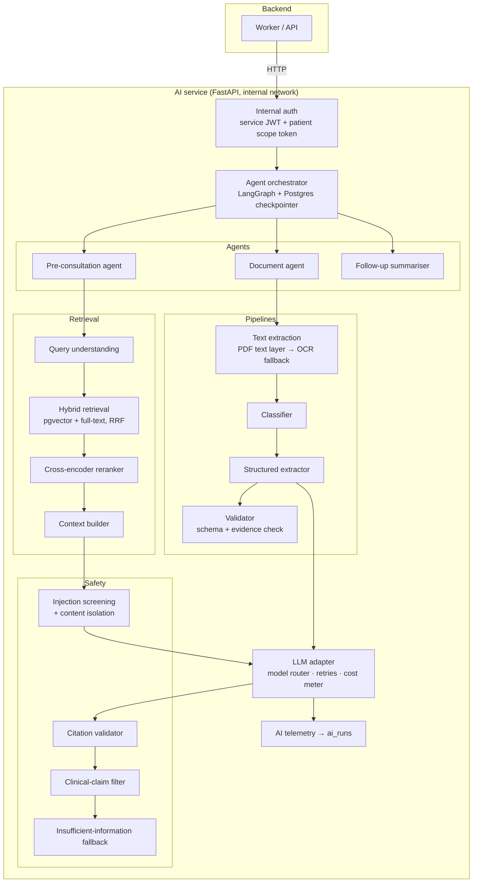

### 6.1 Model plan (all behind adapters; swappable per task)

| Task | Default | Why |
|---|---|---|
| Digital PDF text | PyMuPDF text layer | Exact, free, and fast. Most lab PDFs are digital. |
| Scanned / photo OCR | PaddleOCR (self-hosted). Cloud OCR (e.g. AWS Textract, Mumbai region) available via adapter. | Keeps PHI in-house by default. Cloud OCR is available where quality demands it. |
| Embeddings | `BAAI/bge-m3` (1024-d, multilingual), self-hosted | Handles English plus Indian-language text. Embeddings never leave the infrastructure. |
| Reranker | `bge-reranker-v2-m3` cross-encoder, self-hosted | Large precision gain for small top-k |
| Classification, query understanding | Small, fast LLM (e.g. Claude Haiku 4.5) | Cheap, low latency |
| Extraction, briefs, RAG answers | Strong LLM (e.g. Claude Sonnet 5.5) with structured JSON output | Accuracy and faithfulness matter most here |
| Tests, demo, CI | `FakeLLMProvider` (deterministic) | Tests and CI never call paid APIs |

> ⚠️ **Decision required:** sending PHI to any third-party LLM needs a data-processing agreement, a zero-retention configuration, and a clear residency stance (see Risk R1). The adapter makes a self-hosted model a configuration change, not a rewrite.

### 6.2 Anti-fabrication design (the core of AI safety)

1. **Evidence-anchored extraction.** Every extracted field must include an `evidence.quote`. The validator checks that the quote **exists in the OCR text** (normalised fuzzy match). If it does not, the field is **dropped**, not "corrected". Missing values stay `null`. The model never fills them in.
2. **Statement-level citations.** Briefs and RAG answers are generated as JSON: `[{text, source_ids[]}]`. The citation validator rejects any `source_id` that was not in the retrieved context and drops uncited statements. If nothing survives, the response is **"Insufficient information. Please consult the doctor."**
3. **Clinical-claim filter.** Output is screened, using rules plus a classifier, for diagnostic or treatment-recommendation language ("you likely have…", "increase the dose…"). Flagged statements are removed and logged. Diagnoses appear only when *quoted from a source document* and attributed to it ("Report dated 12 Aug 2026 states: 'Impression: …'").
4. **Content isolation against prompt injection.** Document text is untrusted data. It is wrapped in delimited blocks and labelled as data in the system prompt. Agents have **no tools that can act on instructions found inside documents**. Extraction and summarisation nodes have no tool access at all. Injection patterns are flagged and recorded on `ai_runs`.
5. **Data minimisation.** The patient's name, phone number, and IDs are replaced with "the patient" before LLM calls. Only the fields needed for the task are sent.
6. **Honest confidence.** Confidence shown in the UI is computed from OCR confidence, evidence-match strength, and validator results. The LLM's self-reported certainty is never shown as if it were calibrated.
7. **Full traceability.** Each run stores its model, prompt version, input hash, output, sources, latency, tokens, and cost in `ai_runs` and `ai_sources`. Prompts live in versioned files (`prompts/brief/v3.md`).

### 6.3 Where humans approve

| Action | AI role | Human gate |
|---|---|---|
| Extracted lab values / medications | Proposes (marked *AI-extracted · unverified*) | A doctor can mark them *verified*. Unverified data is always labelled. |
| Doctor brief | Drafts | The doctor reads it alongside the sources. It is never shown to the patient as clinical advice. |
| Diagnosis, prescription, treatment change | **None** | Doctor only |
| Consultation outcome (online / physical / emergency) | **None** | Doctor only |
| Follow-up escalation | Summarises the patient response. A **deterministic rule** flags red-flag terms. | The doctor decides what to do. The patient always sees static "If this is an emergency, call 112" guidance. |
| Record sharing / consent | **None** | Patient only |

---

## 7. Data Flow — Patient Consultation

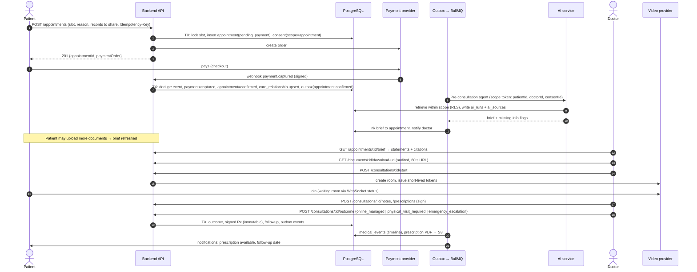

**Outcome branches**

- **A. Online management.** Prescription and notes are issued and a follow-up is scheduled.
- **B. Physical examination required.** The doctor creates an in-clinic appointment, either a linked booking or a slot hold for the patient to confirm. Care stays inside the same relationship and history.
- **C. Emergency escalation.** The doctor triggers it. The patient sees immediate static emergency guidance (112 / nearest emergency department) and the event is audited and flagged. **The system never initiates an emergency decision.**

---

## 8. Data Flow — Document Processing

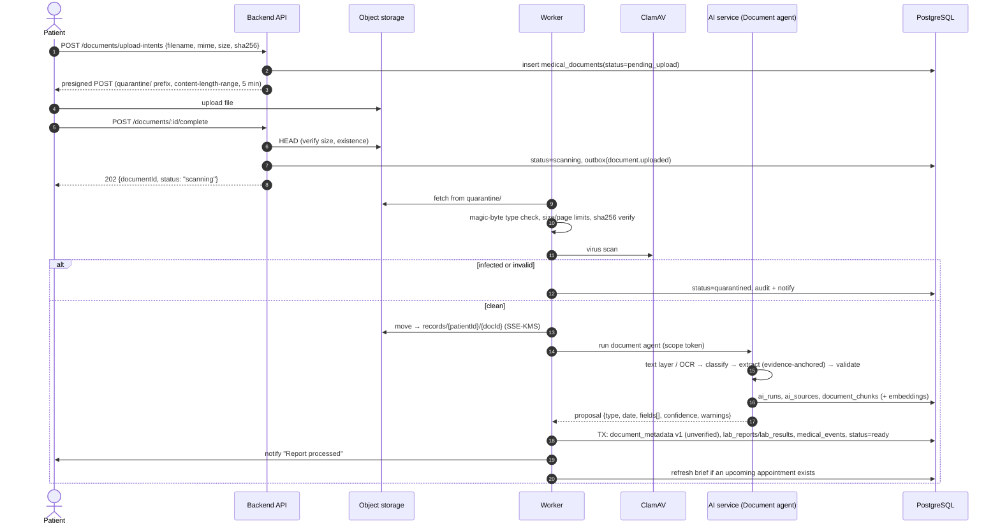

The patient polls `GET /documents/:id` or receives a WebSocket `document.status` event. The original file is never modified. Extracted data is stored separately and versioned. Re-extraction (for example with a better model) creates `document_metadata` v2 and leaves v1 untouched.

---

## 9. RAG Architecture

```mermaid
flowchart LR
  Q[Doctor question] --> PC{Backend:<br/>AccessPolicy}
  PC -->|deny| X[404 + audit deny]
  PC -->|allow| TOK[Mint scope token<br/>patientId · categories · purpose · 5 min]
  TOK --> QU[Query understanding<br/>intent · time range · record types]
  QU --> RET[Hybrid retrieval<br/>vector KNN + full-text<br/>WHERE patient_id = scope<br/>RLS-enforced role]
  RET --> FUSE[Reciprocal rank fusion]
  FUSE --> RR[Cross-encoder rerank → top 8]
  RR --> CTX[Context builder<br/>S1..Sn source blocks<br/>dates + provenance labels]
  CTX --> LLM[LLM: JSON statements<br/>each with source_ids]
  LLM --> VAL[Citation validator<br/>+ claim filter]
  VAL -->|no supported statements| INS["Insufficient information.<br/>Please consult the doctor."]
  VAL --> ANS[Grounded answer + citations]
  ANS --> LOG[ai_runs · ai_sources · record_access_logs]
```

**Indexing**

- **Structured records become "cards".** A prescription, a lab result set, consultation notes, or a follow-up is rendered into a compact, dated text card (one chunk per card), so retrieval sees the same facts the database holds.
- **Documents are chunked by section or page**, at about 500 tokens with 15% overlap. Each chunk carries `source_type`, `source_id`, `source_date`, `provenance`, and page metadata.
- Indexing is triggered by the outbox (`document.processed`, `prescription.signed`, …) and is idempotent on `(source_id, content_hash)`.

**Retrieval design choices**

- **Exact search inside one patient, not ANN across all patients.** A single patient's corpus is small (hundreds to low thousands of chunks). Filtering by `patient_id` on a B-tree and computing exact cosine distance is fast and avoids the recall loss of filtered HNSW. Clinical RAG never needs cross-patient search, so no global ANN index is created.
- **Hybrid search.** Lab names, drug names, and abbreviations (HbA1c, TSH) match far better lexically. Vector search handles paraphrase ("sugar levels").
- **Temporal awareness.** Query understanding extracts time intent ("last consultation", "since March") and turns it into SQL filters before ranking.

**Scope enforcement (defence in depth)**

1. The backend `AccessPolicy` checks consent before calling the AI service.
2. A signed scope token carries the allowed `patient_id` and categories. The AI service verifies it independently.
3. The AI service's DB role is subject to **Postgres RLS** on `ai.document_chunks`. It sets `app.allowed_patient_id` per transaction. A bug in query code still cannot read another patient's chunks.
4. The citation validator rejects any source not in the retrieved, in-scope set.

---

## 10. Agent Workflows (LangGraph)

Agents are **bounded state machines**, not open-ended tool-using loops. Each node has a fixed allowed-action list, and state is checkpointed to Postgres so runs are resumable and auditable.

### 10.1 Document agent

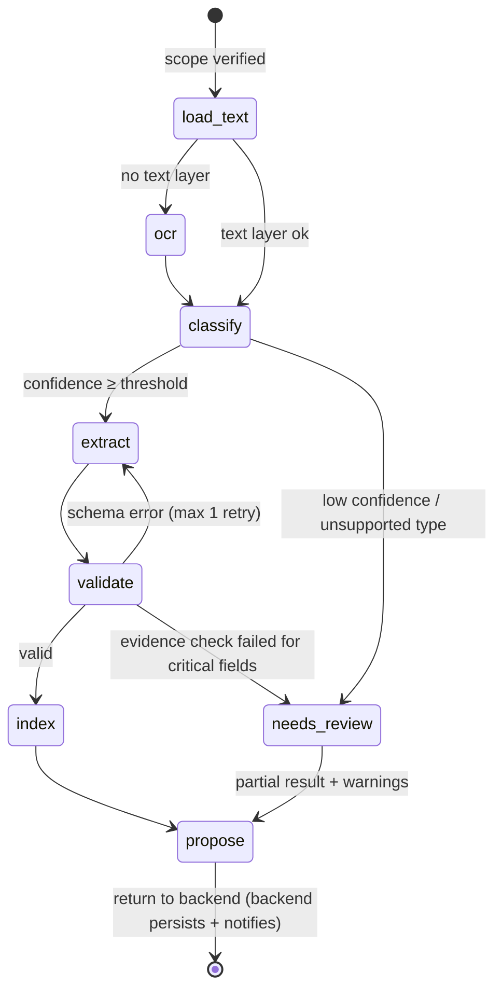

### 10.2 Pre-consultation agent

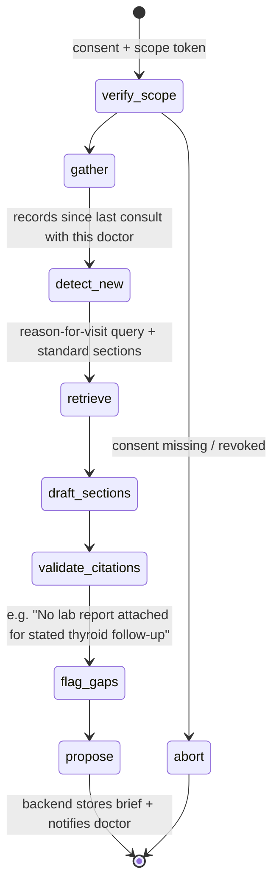

**Brief sections:** Reason for consultation (patient's words, quoted) · Relevant recent history · Recent reports (key values exactly as stated, with units and stated reference ranges) · Previous prescriptions · Changes since last visit · Pending follow-ups · Patient's questions · Missing information. **Every line links to a source.**

### 10.3 Follow-up workflow

Most of this is deliberately **deterministic**. An LLM adds nothing to scheduling a reminder.

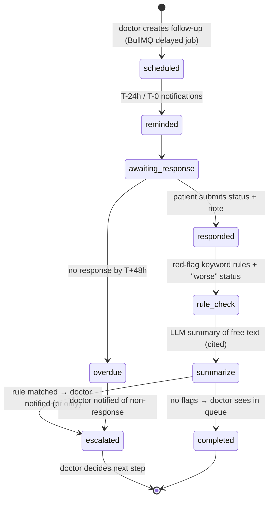

### 10.4 Agent permission boundaries

| Agent | Can read | Can write | Can never |
|---|---|---|---|
| Document | The document being processed | `ai.*` tables only. Returns a proposal. | Write clinical tables, notify anyone, read other patients |
| Pre-consultation | The patient's records within consent scope | `ai.*` tables only | Diagnose, recommend treatment, contact the patient |
| Follow-up summariser | That follow-up's response and the originating consultation | `ai.*` tables only | Decide on escalation (rules plus the doctor do), message the patient |

---

## 11. Security Architecture

### 11.1 Controls by concern

| Concern | Control |
|---|---|
| **Passwords** | argon2id (memory-hard), breached-password check (k-anonymity range API, optional), lockout with progressive delay |
| **Tokens** | Access JWT (EdDSA or ES256, 10 min, `aud`/`iss`/`jti`) · refresh token as an opaque random string, stored **hashed**, **rotated on every use**, with **reuse detection** that revokes the whole family · server-side session list with "log out other devices" |
| **MFA** | TOTP, required for doctors and admins (Phase 2), optional for patients |
| **CSRF** | Refresh/logout cookies use `SameSite=Strict` plus an Origin/Referer check plus a double-submit token. API calls use a Bearer header, which is not CSRF-able. |
| **XSS** | React escaping, no `dangerouslySetInnerHTML`, strict CSP (no inline scripts), sanitised Markdown rendering for AI text |
| **SQLi** | Parameterised Knex queries only. Raw SQL requires bindings (enforced by a lint rule). |
| **IDOR / broken access control** | Actor-scoped repositories, the three-gate model (§5.3), 404-on-deny, and an authorisation test matrix in CI |
| **Uploads** | Presigned POST with size limits → quarantine prefix → magic-byte check → ClamAV → allowlist (PDF, JPEG, PNG, HEIC) → page/pixel limits (decompression-bomb guard) → re-encode images → strip EXIF → promote |
| **Document access** | Signed GET URLs issued only after `AccessPolicy` passes, TTL **60 s**, `Content-Disposition` set, and every issuance logged in `record_access_logs`. Revocation blocks new URLs immediately. Previously issued URLs expire within ≤ 60 s. |
| **Encryption in transit** | TLS 1.2+ at Nginx with HSTS. Internal traffic stays on a private network. Phase 3: mTLS between API and AI service. |
| **Encryption at rest** | Layer 1: volume, DB, and S3 encryption (KMS) for **everything**. Layer 2: application-level envelope encryption (AES-256-GCM, per-record data key wrapped by a KMS master key) for high-sensitivity free text: clinical notes, symptom text, follow-up text, MFA secrets, and ABHA IDs. |
| **Consent** | Evaluated **per request**, with no long-lived cache. Revocation takes effect on the next request. A test proves this. |
| **Audit** | Append-only `audit` schema, DB role without UPDATE/DELETE, monthly partitions. Phase 2: hash-chained rows for tamper evidence. |
| **Rate limiting** | Redis-backed limits by IP, user, and route class (stricter on auth, OTP, AI, and uploads) |
| **Secrets** | Only `.env.example` is committed. Docker/CI secrets are injected at runtime. Production uses a cloud secrets manager. gitleaks runs in CI and as a pre-commit hook. |
| **Internal AI API** | Not routed by Nginx. Private Docker/VPC network. Service JWT (audience `ai-service`) plus a per-request patient scope token. |
| **Headers** | helmet: CSP, HSTS, `X-Content-Type-Options`, `Referrer-Policy: no-referrer`, `Permissions-Policy` (camera and mic only on the consultation route) |
| **Logging hygiene** | pino redaction for tokens, passwords, and PHI fields. PHI never appears in logs or error-tracker payloads. |
| **Supply chain** | Lockfiles, `npm audit` and `pip-audit`, Trivy image scans, Dependabot, pinned base images |

### 11.2 Threat model summary (STRIDE)

| Threat | Example | Primary mitigation |
|---|---|---|
| Spoofing | Stolen refresh token | Rotation + reuse detection, short access TTL, MFA for clinicians |
| Tampering | Altering a signed prescription | Immutable signed rows, new version via `supersedes_id`, audit log |
| Repudiation | "I never viewed that record" | `record_access_logs` on every read and every URL issuance |
| Information disclosure | Doctor browsing unrelated patients / RAG leaking another patient | Consent gate, RLS on chunks, scope tokens, cross-patient tests |
| Denial of service | Upload floods, expensive AI calls | Rate limits, per-user AI quotas, queue concurrency caps |
| Elevation of privilege | Patient calling doctor endpoints | Permission middleware plus resource policies, role matrix tests |
| AI-specific | Prompt injection inside an uploaded PDF | Content isolation, tool-less nodes, output schema, claim filter |

### 11.3 Regulatory posture (design intent, not a compliance claim)

The design is meant to **support** obligations under India's **Digital Personal Data Protection Act, 2023** and its Rules, the **Telemedicine Practice Guidelines (2020)**, and the **IT Act, 2000** with its SPDI Rules. In practice that means:

- purpose-bound, revocable consent;
- data minimisation;
- breach-response hooks;
- access and erasure request flows, subject to medico-legal retention exceptions;
- verified registered medical practitioners;
- a configurable prescribing-rules list.

ABDM/ABHA interoperability is a Phase 3 integration. **Formal legal review is required before handling real patient data.** The project will make no compliance claims until that review is done.

---

## 12. API Module List

Base path `/api/v1`. JSON, cursor pagination (`?cursor=&limit=`), RFC 7807 errors, an `Idempotency-Key` header on booking/payment/upload intents, and a `X-Request-Id` echo. An OpenAPI 3.1 spec is generated from the Zod schemas.

| Module | Endpoints (representative) | Roles |
|---|---|---|
| **auth** | `POST /auth/register` · `POST /auth/login` · `POST /auth/refresh` · `POST /auth/logout` · `GET/DELETE /auth/sessions` · `POST /auth/password/*` · `POST /auth/mfa/*` | public / all |
| **users** | `GET/PATCH /users/me` · `GET /users/me/permissions` | all |
| **patients** | `GET/PATCH /patients/:id` · `GET/POST /patients/:id/dependents` | patient (self/guardian), doctor (consented, read) |
| **doctors** | `GET /doctors` (search) · `GET /doctors/:id` · `PATCH /doctors/me` · `POST /doctors/me/verification` · `GET/PUT /doctors/me/availability` · `POST /doctors/me/invites` | public read; doctor |
| **my-doctors** | `GET /patients/:id/care-relationships` · `POST /care-relationships/accept-invite` | patient |
| **clinics** | `GET /clinics/:id` · `GET/POST /clinics/:id/members` · `GET /clinics/:id/schedule` · `GET /clinics/:id/billing-summary` | clinic admin, platform admin |
| **slots** | `GET /doctors/:id/slots?from&to&mode` · `POST /slots/:id/hold` | patient, clinic admin |
| **appointments** | `POST /appointments` · `GET /appointments` · `GET /appointments/:id` · `POST /appointments/:id/cancel` · `POST /appointments/:id/reschedule` · `POST /appointments/:id/check-in` | patient, doctor, clinic admin |
| **consultations** | `POST /consultations/:id/start` · `POST /consultations/:id/join-token` · `POST /consultations/:id/end` · `POST /consultations/:id/notes` · `POST /consultations/:id/outcome` | doctor; patient (join) |
| **prescriptions** | `POST /prescriptions` (draft) · `PATCH /prescriptions/:id` · `POST /prescriptions/:id/sign` · `GET /prescriptions/:id` · `GET /prescriptions/:id/pdf-url` | doctor; patient (read) |
| **documents** | `POST /documents/upload-intents` · `POST /documents/:id/complete` · `GET /documents` · `GET /documents/:id` · `GET /documents/:id/download-url` · `POST /documents/:id/verify-extraction` · `DELETE /documents/:id` | patient, doctor (consented) |
| **timeline** | `GET /patients/:id/timeline?types&from&to` · `GET /patients/:id/timeline/export` | patient, doctor (consented) |
| **followups** | `POST /followups` · `GET /followups` · `POST /followups/:id/responses` · `POST /followups/:id/close` | doctor; patient (respond) |
| **consents** | `GET /patients/:id/consents` · `POST /consents` · `POST /consents/:id/revoke` · `GET /patients/:id/access-log` | patient (manage, view who accessed) |
| **notifications** | `GET /notifications` · `POST /notifications/:id/read` · `GET/PUT /notifications/preferences` | all |
| **payments** | `POST /payments/orders` · `GET /payments` · `POST /payments/:id/refund` · `POST /webhooks/payments/:provider` (signature-verified, no auth) | patient, admin |
| **ai** | `GET /appointments/:id/brief` · `POST /appointments/:id/brief/regenerate` · `POST /patients/:id/ask` (RAG) · `POST /ai/runs/:id/feedback` · `GET /ai/runs/:id/sources` | doctor (Phase 2: limited patient Q&A) |
| **jobs** | `GET /jobs/:id` (status of async work owned by the actor) | all |
| **admin** | `GET /admin/verifications` · `POST /admin/verifications/:id/decision` · `GET/PATCH /admin/users/:id` · `GET /admin/clinics` · `GET /admin/appointments` · `GET/POST /admin/disputes` · `GET /admin/analytics/*` · `GET /admin/audit-logs` | platform admin; support (read-limited, PHI-masked) |
| **health** | `GET /health/live` · `GET /health/ready` (DB, Redis, S3, AI reachability) · `GET /metrics` (internal only) | infra |

**Sample contract: AI brief**

```json
GET /api/v1/appointments/0192.../brief
200 {
  "data": {
    "status": "ready",
    "generatedAt": "2026-10-01T09:30:00Z",
    "aiRunId": "0192...",
    "disclaimer": "AI-generated summary of existing records. Not a diagnosis. Verify against sources.",
    "sections": [
      { "key": "recent_reports", "title": "Recent reports",
        "statements": [
          { "text": "HbA1c reported as 7.8 % (lab reference range stated: 4.0–5.6 %) on 14 Sep 2026.",
            "provenance": "ai_extracted_unverified",
            "sources": [{ "type": "lab_result", "id": "0192...", "documentId": "0192...", "page": 1, "quote": "HbA1c 7.8 %" }] }
        ] }
    ],
    "missingInformation": ["Patient mentions thyroid medication but no thyroid test report is on file."]
  }
}
```

---

## 13. Folder Structure

```
healthbridge/
├── frontend/                     # React + Vite (see §4)
│   ├── src/ …
│   ├── tests/                    # Vitest + Testing Library + MSW
│   ├── Dockerfile                # build → nginx static stage
│   └── vite.config.js
├── backend/
│   ├── src/
│   │   ├── app.js                # express app factory (DI of deps)
│   │   ├── server.js             # http + socket bootstrap
│   │   ├── worker.js             # BullMQ workers entrypoint
│   │   ├── config/               # env schema (Zod) → frozen config
│   │   ├── core/
│   │   │   ├── http/             # requestId, errorHandler, validate, problem+json
│   │   │   ├── auth/             # jwt, authenticate, requirePermission
│   │   │   ├── db/               # knex instance, unitOfWork, uuidv7
│   │   │   ├── crypto/           # envelope encryption, hashing
│   │   │   ├── events/           # outbox writer, relay, event registry
│   │   │   ├── queue/            # BullMQ factory, job conventions
│   │   │   ├── logger/           # pino + redaction
│   │   │   ├── metrics/          # prom-client
│   │   │   └── adapters/
│   │   │       ├── storage/      # s3, (minio via s3)
│   │   │       ├── payments/     # razorpay, mock
│   │   │       ├── video/        # livekit, mock
│   │   │       ├── notify/       # email(smtp/ses), sms, whatsapp, mock
│   │   │       └── ai/           # internal AI client
│   │   ├── modules/
│   │   │   ├── identity/ patients/ providers/ care-access/ scheduling/
│   │   │   ├── consultations/ prescribing/ records/ timeline/ followups/
│   │   │   ├── payments/ notifications/ ai-gateway/ audit/ admin/ realtime/
│   │   │   │   └── <module>/
│   │   │   │       ├── routes.js  controller.js  service.js  repository.js
│   │   │   │       ├── schemas.js policies.js  events.js  jobs.js
│   │   │   │       └── domain/    # pure logic
│   │   └── jobs/                 # cross-module scheduled jobs
│   ├── migrations/               # Knex migrations (single schema authority)
│   ├── seeds/demo/               # synthetic data + synthetic PDFs
│   ├── tests/  unit/ integration/ security/
│   └── Dockerfile
├── ai-service/
│   ├── app/
│   │   ├── main.py
│   │   ├── api/internal/         # /v1/agents/*, /v1/rag/*, /v1/index/*
│   │   ├── core/                 # config, auth (service + scope tokens), db, logging
│   │   ├── agents/  document/ pre_consultation/ followup/   # LangGraph graphs
│   │   ├── pipelines/ text/ ocr/ classify/ extract/ validate/
│   │   ├── rag/  chunking/ embeddings/ retrieval/ rerank/ context/ citations/
│   │   ├── llm/  providers/ router.py prompts/ (versioned)
│   │   ├── safety/  injection.py claims.py minimise.py fallback.py
│   │   └── telemetry/            # ai_runs writer, metrics
│   ├── evals/                    # golden synthetic datasets + eval runners
│   ├── tests/
│   ├── pyproject.toml
│   └── Dockerfile
├── shared/
│   ├── constants/                # roles, permissions, enums, event names
│   └── schemas/                  # Zod schemas shared by frontend + backend
│                                 # (+ exported JSON Schema for the AI service contract)
├── infra/
│   ├── docker/                   # compose files: dev, test, prod overlay
│   ├── nginx/                    # nginx.conf, security headers
│   ├── postgres/                 # init (extensions, roles, RLS for ai schema)
│   ├── observability/            # prometheus, grafana dashboards (Phase 2)
│   └── deploy/                   # production deployment manifests
├── docs/                         # ARCHITECTURE, SYSTEM_DESIGN, API, DATABASE, AI_ARCHITECTURE,
│                                 # SECURITY, DEPLOYMENT, TESTING, DECISIONS (ADRs)
├── .github/workflows/            # ci.yml, security.yml, deploy.yml
├── docker-compose.yml
├── .env.example
└── README.md
```

---

## 14. Technology Justification

| Choice | Why | Alternatives considered |
|---|---|---|
| **Modular monolith** | One deployable, one transaction scope, fast iteration for a small team. Module boundaries keep later extraction cheap. | Microservices: premature distributed-systems cost |
| **Separate AI service (Python)** | The ML/AI ecosystem (LangGraph, OCR, sentence-transformers) is Python-native. It scales and deploys independently, and the network boundary isolates the blast radius. | AI in Node: weaker ML ecosystem |
| **PostgreSQL + pgvector** | One database for relational data, full-text search, and vectors. Transactional consistency between records and their index. RLS for scope enforcement. Managed everywhere. | Pinecone/Weaviate: another PHI store, another sync problem |
| **Knex** | Explicit, parameterised SQL with migrations. Postgres features used here (exclusion constraints, RLS, `tstzrange`, `vector`) are first-class rather than fought. | Prisma: weak with pgvector, RLS, and exclusion constraints · Sequelize: heavy magic |
| **Zod in `/shared`** | One validation source for frontend forms, API validation, and OpenAPI generation | Joi, Yup: no clean sharing or OpenAPI story |
| **Redis + BullMQ** | Mature delayed jobs, retries, rate-limited queues, and a dashboard. Redis is also used for rate limiting, cache, and Socket.IO fan-out. | RabbitMQ/Kafka: more ops for no MVP benefit |
| **Transactional outbox** | Guarantees events are not lost between a DB commit and the enqueue | Dual writes: silent data loss under failure |
| **LangGraph** | Explicit state graphs, checkpointing, human-in-the-loop interrupts, deterministic edges. Fits "bounded agents". | Free-form ReAct agents: unbounded, unauditable |
| **Self-hosted embeddings, OCR, and reranker** | PHI stays in-house for the highest-volume operations. No per-call cost. Multilingual. | Hosted embedding APIs: PHI egress on every chunk |
| **LLM via adapter** | Provider choice is a business and legal decision, not an architectural one | Hard-wired SDK |
| **S3-compatible storage** (MinIO in dev) | Signed URLs, SSE-KMS, versioning, and object lock for documents | Files in Postgres: bloat and backups |
| **Socket.IO** | Rooms, reconnection, auth handshake, Redis adapter for horizontal scale | Raw `ws`: rebuilding all of that |
| **Video: LiveKit** (adapter) | Open-source WebRTC SFU. Cloud or self-hosted in an Indian region. Short-lived room tokens. | Custom WebRTC: insecure and expensive · 100ms / Daily: good managed options behind the same adapter |
| **Payments: Razorpay first** (adapter) | India-native (UPI, cards, netbanking), signed webhooks, refunds API | Stripe India: narrower local coverage |
| **React + Vite + Tailwind + Radix** | As specified. Radix supplies accessible primitives without imposing a visual style. | MUI: generic "dashboard template" look |
| **TanStack Query** | Caching, retries, invalidation, and background refetch for server state | Redux: boilerplate for what is mostly server state |
| **Vitest / Supertest / Playwright / pytest** | Fast ESM-native tests, real HTTP tests, real-browser e2e | Jest: slower ESM story |
| **Docker Compose → managed cloud** | Same images in dev, CI, and production. Production target: AWS `ap-south-1` (RDS Postgres with pgvector, ElastiCache, S3, ECS/Fargate). | Kubernetes: not justified at MVP scale |
| **pino + prom-client + Sentry-compatible tracking** (self-hostable GlitchTip) · OpenTelemetry in Phase 2 | Structured JSON logs, metrics endpoint, error tracking with PHI scrubbing | — |

---

## 15. Feature Breakdown: MVP vs Phase 2 vs Phase 3

### MVP: the complete core loop, done properly

- Auth (email + password, refresh rotation, sessions), RBAC, actor-scoped authorisation, audit and access logs
- Patient profile + dependents · Doctor profile + **manual** verification workflow (admin queue) · Clinic basics
- "My Doctors" care relationships · doctor search
- Availability rules → slot generation → booking with holds and an exclusion constraint
- Payments: Razorpay test mode plus a mock provider, webhook idempotency, cancellation, and a basic full refund
- Booking-scoped consent with record selection · consent list and revoke · "who accessed my records"
- Document upload pipeline (quarantine, scan, validate) → **Document agent** (text/OCR, classify, evidence-anchored extraction, validate) → timeline
- Health timeline (view and filter) · lab results table with source links
- **Pre-consultation agent → Doctor Brief** with statement-level citations and feedback
- Consultation: video via adapter (LiveKit), clinical notes (SOAP), **outcome A/B/C**, prescription builder → signed immutable PDF
- Follow-ups: schedule, reminders, patient status response, rule-based escalation flag
- Notifications: in-app + email (Mailpit in dev)
- **Doctor RAG Q&A** over one consented patient's records, with citations and the insufficient-information fallback
- Demo mode with synthetic seed data · Docker Compose · CI (lint, tests, scans, build)

### Phase 2: operational depth

- Clinic admin suite: staff management, schedule board, patient flow, billing overview
- Real-time waiting room, doctor online status, live appointment updates
- SMS / WhatsApp adapters (DLT templates) · notification preferences
- MFA (TOTP) for clinicians and admins · phone OTP login
- Disputes, partial refunds, settlements, reconciliation jobs
- Doctor analytics and platform analytics dashboards (metrics from §18 of the brief)
- LLM summary of follow-up free text · AI feedback analytics · eval suite gated in CI
- Doctor invite links / clinic QR to onboard existing patients
- Record sharing with another doctor (second opinion) as purpose-scoped consent
- OpenTelemetry tracing, Grafana dashboards, hash-chained audit logs
- Background re-extraction when models or prompts improve (versioned metadata)

### Phase 3: ecosystem and scale

- ABDM / ABHA integration (health-ID linking, consent-manager flows) · FHIR R4 export
- Pharmacy role: e-prescription routing to the patient's chosen pharmacy
- Patient-facing record Q&A (explain-only, heavily constrained, with a separate safety review)
- Multilingual UI and summaries (Hindi first) · mobile app (React Native)
- Break-glass emergency access (time-boxed, double-audited, reviewed)
- mTLS internally, read replicas, extracting the AI-gateway or notifications into separate services if load justifies it

---

## 16. Implementation Order

Each milestone ships working, tested, documented software and builds on the previous ones. No milestone breaks earlier functionality: the CI test suite is the contract.

| # | Milestone | Deliverables | Key tests |
|---|---|---|---|
| **M0** | Foundations | Monorepo, Docker Compose (Postgres+pgvector, Redis, MinIO, Mailpit), backend skeleton (config, logger, requestId, errors, health/readiness), frontend shell + design tokens, AI-service skeleton with internal auth, CI pipeline, `.env.example`, ADR-001…005 | health/ready checks, config validation |
| **M1** | Identity and RBAC | Users, roles, permissions, sessions, register/login/refresh/logout, permission middleware, audit log writer, frontend auth flows + guards | token rotation, reuse detection, role matrix, lockout |
| **M2** | Patients, doctors, clinics | Profiles, dependents, doctor verification queue, clinic membership, care relationships, `AccessPolicy` v1 + record-access logging | **Patient A ≠ Patient B**, guardian access, 404-on-deny |
| **M3** | Scheduling and booking | Availability → slots job, holds, booking transaction, exclusion constraint, appointment state machine, patient + doctor appointment UIs | concurrency (parallel booking of the same slot), state transitions |
| **M4** | Payments | Provider adapter (mock + Razorpay test), orders, signed webhooks, idempotency, cancellation/refund, outbox + relay | duplicate webhook, failure path, refund, outbox replay |
| **M5** | Consent and records storage | Consents (booking-scoped + manual), revoke, upload intents, quarantine → scan → promote, signed download URLs, access log UI | **revoked consent blocks immediately**, **expired URL rejected**, upload attack cases |
| **M6** | Document intelligence | Document agent (text/OCR, classify, extract, validate), embeddings + chunk index with RLS, document_metadata, lab results, timeline events, demo synthetic reports | golden-set extraction metrics, **no-fabrication tests**, injection-in-PDF test |
| **M7** | Timeline | `medical_events` projections from all modules, timeline UI, JSON export | ordering, provenance labelling, scope |
| **M8** | Doctor Brief and RAG | Pre-consultation agent, brief UI with citations and feedback, doctor RAG Q&A, citation validator, insufficient-info fallback | **unauthorised retrieval blocked**, citation validity, fallback correctness |
| **M9** | Consultation and prescribing | Video adapter, waiting-room status, SOAP notes, outcome A/B/C, prescription builder, signing, immutable PDF | immutability, outcome flows, notifications |
| **M10** | Follow-ups and notifications | Delayed reminders, patient responses, rule escalation, notification inbox + email | timing, escalation rules, idempotent reminders |
| **M11** | Admin, observability, hardening | Admin verification and user management, audit viewer, metrics, Bull Board, e2e Playwright suite, security review pass, full docs set | e2e patient journey, OWASP checklist |
| **M12** | Deployment | Production compose/ECS manifests, TLS, backups + restore drill, staging environment, CD workflow | smoke tests post-deploy, restore test |

---

## 17. Major Technical Risks

| # | Risk | Impact | Mitigation |
|---|---|---|---|
| **R1** | **PHI sent to a third-party LLM** (DPDP, residency, retention) | High | LLM adapter, data minimisation and pseudonymisation, a provider with zero-retention and a DPA, or a self-hosted model for production. **You need to decide this (see below).** |
| **R2** | **OCR quality on handwritten Indian prescriptions** is poor with any engine | High | Set expectations: handwritten documents are stored and shown but extraction is marked low-confidence or "needs clinician review". Never auto-promote it. Optional cloud OCR adapter. |
| **R3** | **LLM hallucination** in briefs or answers | High | Evidence-anchored extraction, statement-level citation validation, claim filter, fallback, doctor feedback loop, eval suite |
| **R4** | **Regulatory uncertainty** (telemedicine rules, prescribing restrictions, record retention, doctor verification) | High | Manual doctor verification (no reliable public registry API is assumed), configurable prescribing rules, retention policy kept as configuration, no compliance claims, legal review before real data |
| **R5** | **Scope is very large** for one developer | High | Strict MVP (§15), milestone-based delivery, each milestone demoable on its own |
| **R6** | **Access-control bugs** (the most likely serious defect class) | High | Single `AccessPolicy` choke point, actor-scoped repositories, RLS on AI data, an authorisation test matrix that runs on every PR |
| **R7** | Consent revocation versus already-issued signed URLs | Medium | 60 s TTL, documented behaviour, URL issuance audited. Proxy-streaming available for the most sensitive types if required. |
| **R8** | Self-hosted models need CPU/RAM (bge-m3 + reranker + PaddleOCR ≈ 3–5 GB RAM) | Medium | Lazy model loading, an option to run the AI service on a separate host, smaller fallback models for the laptop dev profile |
| **R9** | Video provider cost and reliability | Medium | Adapter, LiveKit self-host option, graceful audio-only fallback |
| **R10** | Payment edge cases (paid but slot lost, double webhooks) | Medium | Slot hold during payment, idempotent webhooks, reconciliation job, auto-refund on unrecoverable conflicts |
| **R11** | **Dev environment: the repo is inside OneDrive.** Syncing `node_modules`, Docker volumes, and model caches causes file locks, slowness, and sync conflicts on Windows. | Medium | **Move the repo outside OneDrive** (e.g. `C:\dev\healthbridge`), use Docker Desktop with the WSL2 backend, and keep model caches in Docker volumes |
| **R12** | AI cost growth | Low–Medium | Per-run cost tracking in `ai_runs`, model routing (small models for simple tasks), brief caching keyed by record versions |

### Assumptions

- A solo developer, India-first launch, English UI for the MVP.
- Synthetic data only until a legal review is done. No real patient data is used in development.
- Production target is AWS Mumbai (`ap-south-1`). The architecture remains cloud-portable.
- Doctor verification is a manual admin workflow. Registration numbers are checked by humans against council registries.

### Decisions needed before M0

1. **LLM provider for PHI:** a hosted LLM API (e.g. Claude) with zero retention and pseudonymisation, or self-hosted only? Recommended: a hosted provider behind the adapter for development and demo on synthetic data, with the production decision made before any real data is handled.
2. **Repo location:** OK to move the project out of OneDrive (to e.g. `C:\dev\healthbridge`) and initialise git?
3. **Video provider:** LiveKit (recommended), or a managed alternative such as 100ms or Daily?
4. **Payments:** Razorpay as the first adapter (recommended)?
5. **Knex** rather than Prisma (recommended, for the reasons in §14)?
