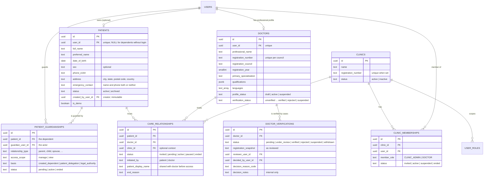

# Database

PostgreSQL 17 with `pgcrypto`, `citext`, `btree_gist`, `pg_trgm` and `vector`. All schema
changes are Knex migrations in `backend/migrations/` (ADR-0003).

## Roles

| Role | Used by | Privileges |
|---|---|---|
| `hb_owner` | migrations only | owner of all objects |
| `hb_app` | backend | DML on `public` (subject to RLS on patient-scoped tables); SELECT/INSERT on `audit` and `ai`; EXECUTE on `authz` functions; no DDL, no RLS bypass |
| `hb_ai` | AI service | `ai` schema only; no access to `public` |

## Migrations

| Migration | Contents |
|---|---|
| `20261001000000_foundation` | extensions, `ai` and `audit` schemas, default privileges, `set_updated_at()` |
| `20261002000000_identity_rbac_audit` | `roles`, `permissions`, `role_permissions`, `users`, `user_roles`, `sessions`, `audit.audit_logs` + append-only triggers, RBAC seed |
| `20261003000000_patients_doctors_clinics` | `roles.scope`, 9 permissions, `clinics`, `clinic_memberships`, `user_roles.clinic_id` FK + scope trigger, `effective_role_grants`, `patients`, `patient_guardianships`, `doctors`, `doctor_verifications`, `care_relationships`, schema `authz`, RLS policies |

## Identity, RBAC and audit (M1)

Notable constraints and indexes:
- `users_email_live_unique (email) WHERE deleted_at IS NULL`.
- `user_roles` is unique on `(user_id, role_id, COALESCE(clinic_id, nil))`.
- Session CHECKs: hash format, expiry ordering, consistent revocation, allowed revoke
  reasons.
- Partial index for active sessions per user.
- Audit indexes: BRIN on `occurred_at`; B-tree on actor, action, resource, patient and
  request ID.

## Patients, doctors, clinics and care relationships (M2)

### Invariants enforced by the database

| Invariant | Mechanism |
|---|---|
| Clinic roles always have a clinic; global roles never do | `roles.scope` + trigger `user_roles_scope` |
| Clinic roles count only with an active membership in an active clinic | view `effective_role_grants` |
| One open membership per (clinic, user, role); one open care relationship per (patient, doctor); one open guardianship per (patient, guardian); one open verification case per doctor | partial unique indexes |
| A doctor profile is active only if verified | `doctors_active_requires_verified` |
| Care relationships start PENDING (patient-initiated) or INVITED (doctor-initiated); ended ⇔ `ended_at` | CHECK constraints |
| Patient ownership (`user_id`, `created_by_user_id`) never changes | trigger + CHECK |
| Patient-scoped rows visible/writable only by related actors; never deletable | RLS (below) |

### Row-level security

`withActor()` sets `app.user_id` for the transaction. Predicates live in schema `authz`
(SECURITY DEFINER, boolean-only). Clinic membership never satisfies any policy.

| Table | SELECT | INSERT | UPDATE | DELETE |
|---|---|---|---|---|
| `patients` | self, any active guardian, treating doctor | creator = actor and (`user_id` = actor or NULL) | self or `manage` guardian | none |
| `patient_guardianships` | the guardian, or the patient themself | guardian = creator = actor, for a dependent the actor created | guardian or patient | none |
| `care_relationships` | patient side (self/guardian) or the doctor party | patient-initiated by a patient manager, or doctor-initiated by the doctor; requester = actor | patient manager or doctor party | none |
