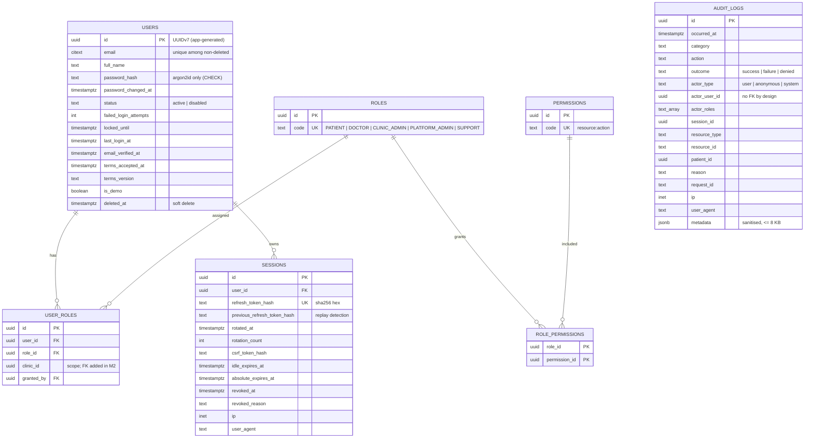
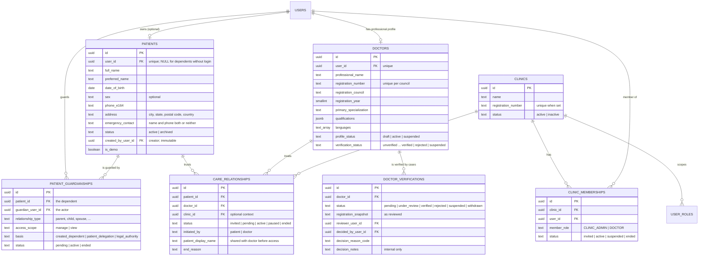
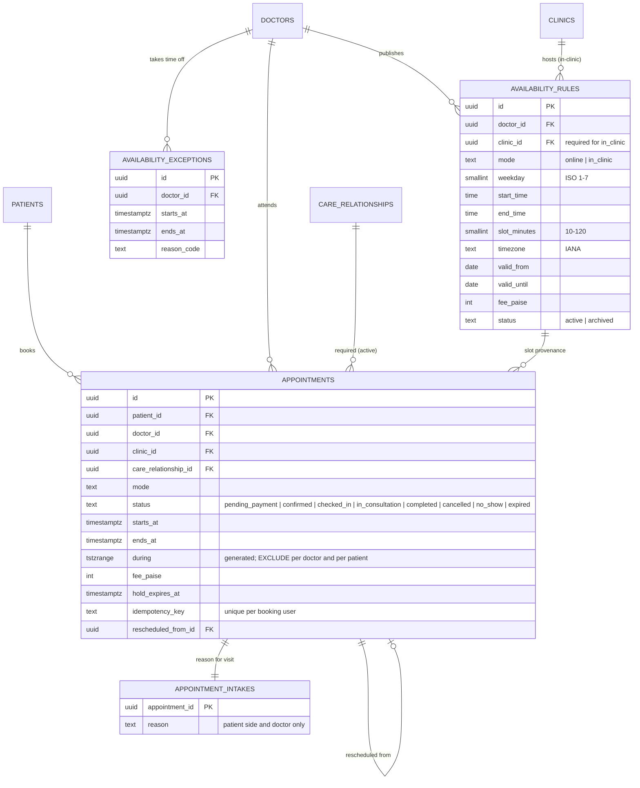
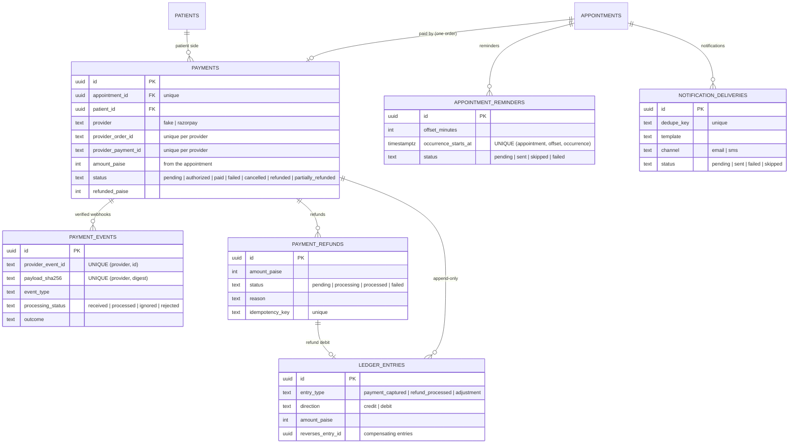
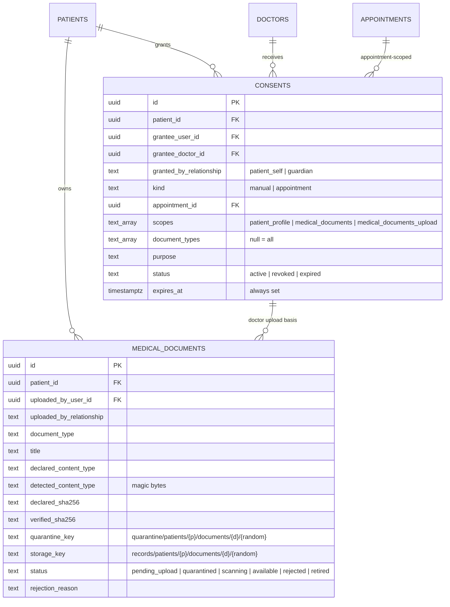

# Database

PostgreSQL 17 with `pgcrypto`, `citext`, `btree_gist`, `pg_trgm` and `vector`. All schema
changes are Knex migrations in `backend/migrations/` (ADR-0003).

## Roles

| Role | Used by | Privileges |
|---|---|---|
| `hb_owner` | migrations only | owner of all objects |
| `hb_app` | backend | DML on `public` (subject to RLS on patient-scoped tables); SELECT/INSERT on `audit` and `ai`; EXECUTE on `authz` functions; no DDL, no RLS bypass |
| `hb_ai` | AI service | `ai` schema only; no access to `public` |

## Migrations

| Migration | Contents |
|---|---|
| `20261001000000_foundation` | extensions, `ai` and `audit` schemas, default privileges, `set_updated_at()` |
| `20261002000000_identity_rbac_audit` | `roles`, `permissions`, `role_permissions`, `users`, `user_roles`, `sessions`, `audit.audit_logs` + append-only triggers, RBAC seed |
| `20261003000000_patients_doctors_clinics` | `roles.scope`, 9 permissions, `clinics`, `clinic_memberships`, `user_roles.clinic_id` FK + scope trigger, `effective_role_grants`, `patients`, `patient_guardianships`, `doctors`, `doctor_verifications`, `care_relationships`, schema `authz`, RLS policies |
| `20261004000000_scheduling_appointments` | `availability_rules`, `availability_exceptions`, `appointments` (two EXCLUDE constraints), `appointment_intakes`, `outbox_events`, RLS and `authz` functions for scheduling, `appointments:manage` / `availability:manage` |
| `20261005000000_payments_outbox_workers` | `payments`, `payment_events`, `payment_refunds`, append-only `ledger_entries`, outbox relay columns, `notification_deliveries`, `appointment_reminders`, `dead_letter_jobs`, system-purpose RLS, audit category `financial`, `payments:*` / `operations:manage` |
| `20261006000000_consents_medical_documents` | `consents`, `medical_documents` (key/lifecycle/immutability guards), `authz.has_consent` / `is_patient_side` / `document_ref`, system purposes `documents` and `consents`, document notification templates, `consents:*` / `access_log:read` |
| `20261007000000_document_intelligence` | `extensions` schema (pgvector moved), `ai.ai_runs`/`ai_sources`/`document_extractions`/`document_chunks` (vector 1024, HNSW, tsvector) with per-role RLS, `ai.scope_patient_id()`, `document_metadata`, immutable `lab_results`, `patients.ai_document_processing`, `authz.ai_processing_enabled()`, `lab_results:verify` |
| `20261008000000_medical_timeline` | `medical_events` projection (provenance, date precision, hidden), RLS (patient side / consent by document type / own appointments), `timeline` system purpose and read policies on sources, `records:export` |
| `20261009000000_doctor_brief_rag` | `ai.doctor_briefs` (AI-scoped RLS; app: the appointment doctor while consent lasts), `brief_feedback` (own rows, consent), `ai_assist:use` |
| `20261010000000_consultations_prescribing` | `consultations` (outcome immutable), `consultation_presence`, `clinical_notes` (encrypted, versioned, immutable when signed), `prescriptions` + `prescription_items` (hash + seal, frozen when signed, one-time PDF fields); `prescriptions` system purpose; timeline event types `consultation` / `prescription`; `consultations:conduct` |
| `20261011000000_followups_notifications` | `follow_ups` (guarded transitions), `follow_up_responses` (append-only, encrypted note), `ai.follow_up_summaries`, `inbox_notifications` (owner may only mark read), `authz.doctor_recipient`; `followups` system purpose; `follow_up` timeline events; `followups:manage`, `followups:respond`, `notifications:read` |

## Identity, RBAC and audit (M1)

Notable constraints and indexes:
- `users_email_live_unique (email) WHERE deleted_at IS NULL`.
- `user_roles` is unique on `(user_id, role_id, COALESCE(clinic_id, nil))`.
- Session CHECKs: hash format, expiry ordering, consistent revocation, allowed revoke
  reasons.
- Partial index for active sessions per user.
- Audit indexes: BRIN on `occurred_at`; B-tree on actor, action, resource, patient and
  request ID.

## Patients, doctors, clinics and care relationships (M2)

### Invariants enforced by the database

| Invariant | Mechanism |
|---|---|
| Clinic roles always have a clinic; global roles never do | `roles.scope` + trigger `user_roles_scope` |
| Clinic roles count only with an active membership in an active clinic | view `effective_role_grants` |
| One open membership per (clinic, user, role); one open care relationship per (patient, doctor); one open guardianship per (patient, guardian); one open verification case per doctor | partial unique indexes |
| A doctor profile is active only if verified | `doctors_active_requires_verified` |
| Care relationships start PENDING (patient-initiated) or INVITED (doctor-initiated); ended ⇔ `ended_at` | CHECK constraints |
| Patient ownership (`user_id`, `created_by_user_id`) never changes | trigger + CHECK |
| Patient-scoped rows visible/writable only by related actors; never deletable | RLS (below) |

### Row-level security

`withActor()` sets `app.user_id` for the transaction. Predicates live in schema `authz`
(SECURITY DEFINER, boolean-only). Clinic membership never satisfies any policy.

| Table | SELECT | INSERT | UPDATE | DELETE |
|---|---|---|---|---|
| `patients` | self, any active guardian, treating doctor | creator = actor and (`user_id` = actor or NULL) | self or `manage` guardian | none |
| `patient_guardianships` | the guardian, or the patient themself | guardian = creator = actor, for a dependent the actor created | guardian or patient | none |
| `care_relationships` | patient side (self/guardian) or the doctor party | patient-initiated by a patient manager, or doctor-initiated by the doctor; requester = actor | patient manager or doctor party | none |

## Scheduling (M3)

| Table | RLS SELECT | INSERT | UPDATE |
|---|---|---|---|
| `appointments` | patient side, doctor party, clinic manager of the appointment clinic | booked by actor, who manages the patient | patient manager, doctor party, clinic manager |
| `appointment_intakes` | patient side and doctor party (**not** clinic staff) | patient manager | none |

`outbox_events` (aggregate, event type, identifier-only payload, `published_at`) is
written in the same transaction as each appointment change.

## Payments, notifications and workers (M4)

`outbox_events` gains `status` (`pending | dispatched | failed`), `available_at` and
`last_error`. `dead_letter_jobs` (queue, job ID, attempts, bounded failure reason,
identifiers) has no patient content.

### System context and RLS

Webhooks and workers run with `app.system_purpose` set and `app.user_id` unset.
`authz.system_purpose()` returns NULL whenever a user is set.

| Table | User access (RLS) | System purpose |
|---|---|---|
| `payments` | SELECT: patient or guardian. INSERT: patient side opening a `pending` payment | `payments`: SELECT, UPDATE |
| `payment_refunds` | SELECT: patient side | `payments`: all but DELETE |
| `payment_events` | none | `payments` |
| `ledger_entries` | none | `payments`: SELECT, INSERT only; UPDATE/DELETE revoked and rejected by a trigger for every role |
| `notification_deliveries` | none | `notifications` |
| `appointment_reminders` | none | `scheduler`, `notifications` |
| `appointments` (added) | — | SELECT: all three purposes; UPDATE: `payments`, `scheduler` |

Functions:

- `authz.appointment_payment_status(id)` returns the status only, to any party who can see
  the appointment.
- `authz.notification_recipients(patient)` returns contacts only, to the notification
  worker only.
- The app role has no DELETE on payment tables.

## Consent and medical documents (M5)

| Table | SELECT (RLS) | INSERT | UPDATE | DELETE |
|---|---|---|---|---|
| `consents` | patient side; the grantee; `consents`/`documents` system | grantor = actor, manages the patient, status `active` | `consents` system only (revoke, expire) | none (revoked) |
| `medical_documents` | patient side (all states); consented doctor: `available` and permitted type (`authz.has_consent`); uploader with upload consent; `documents` system | uploader = actor, `pending_upload`, patient manager or upload consent | `documents` system only | none (revoked) |

The trigger `guard_medical_document_update` rejects, for every role:

- changes to identity columns (patient, uploader, keys, declared type, size and checksum,
  document type);
- status transitions outside the lifecycle.

CHECK constraints tie both object keys to the row's patient and document.

## Document intelligence (M6)

| Table | AI role (`hb_ai`) | App role (`hb_app`) |
|---|---|---|
| `ai.ai_runs` | Rows of the scoped patient (`ai.scope_patient_id()`); insert/update | `documents` system purpose only (read) |
| `ai.ai_sources` | Scoped insert/select | None |
| `ai.document_extractions` | Scoped insert/select (append-only) | Read: patient side, `authz.has_consent(…, 'medical_documents', type)`, `documents` system |
| `ai.document_chunks` | Scoped insert/select (append-only) | **None** |
| `document_metadata` | None | Read like documents; insert/update `documents` system only |
| `lab_results` | None | Read: patient side and consented doctors. Insert: consented treating doctor as themself. Immutable (trigger) |

Neither runtime role may DELETE AI rows. pgvector lives in the `extensions` schema;
`hb_ai` has no usage on `public`.

## Medical timeline (M7)

`medical_events` has unique `(source_type, source_id)`, index
`(patient_id, occurred_at DESC, id DESC)` and the following RLS:

- **SELECT:** the patient side; document and lab events with
  `authz.has_consent(patient, 'medical_documents', document_type)`; appointment events for
  `doctor_user_id = actor`.
- **INSERT/UPDATE:** `timeline` system purpose only.
- **DELETE:** no grant.

The `timeline` purpose has read-only policies on `appointments`, `medical_documents`,
`document_metadata` and `lab_results`.

## Account recovery (M11)

`account_tokens` has the columns `id`, `user_id`, `purpose` (`password_reset` |
`email_verification`), `token_hash` (SHA-256 hex), `created_at`, `expires_at` and
`used_at`.

- **Lifetime:** `expires_at` must be after `created_at` and at most **48 h** later (the
  app uses 30 min for resets and 24 h for verification).
- **Consume-only:** a trigger lets the app set `used_at` once and change nothing else.
  `DELETE`/`TRUNCATE` are revoked from `hb_app`.
- **Replacement:** issuing a new token consumes the user's open tokens for the same
  purpose. The partial index `(user_id, purpose) WHERE used_at IS NULL` supports this.
- **Sessions:** `sessions.revoked_reason` also allows `password_reset`.
