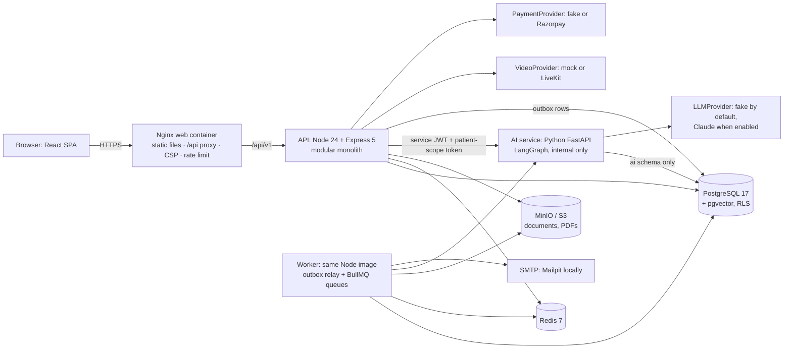

# HealthBridge: complete project workflow (handover guide)

This is the single starting point for anyone, human or AI, taking over HealthBridge. It explains:

- what the product does;
- how a request and a patient's journey flow through the system, phase by phase;
- which technology is used where, and why;
- where the code lives;
- how to run, test and change it safely.

Deeper detail lives in the linked documents. This page tells you which one to open.

> **Ground rules that apply to everything below:**
>
> - Synthetic data only. Never use real patient data.
> - Secrets live in `.env` and are never committed.
> - AI proposes; the backend validates and commits.
> - Audit records are append-only.

---

## 0. Read this first (for an AI agent or a new engineer)

1. **What it is:** a continuity-of-care platform. Patients keep a lasting relationship with the local doctors they trust. Most consultations happen online; a clinic visit happens only when the doctor says it is needed.
2. **Shape:**
   - one **React** web app;
   - one **Node.js/Express** API that holds all business rules (a "modular monolith");
   - **background workers** from the same Node codebase;
   - one internal **Python/FastAPI AI service**;
   - **PostgreSQL** (with pgvector and row-level security) as the system of record;
   - **Redis** for job queues and rate limits;
   - **S3/MinIO** for files.
3. **Start it:** `npm start` (Docker Desktop and Node 24). **Verify everything:** `npm run check` (13 gates).
4. **Never break the invariants** in [§9](#9-rules-that-must-never-be-broken). Each one is also enforced in code or in the database, so breaking one usually makes tests fail.
5. **Status:** milestones M0–M12 and five UX phases are complete, and `main` is the full app. Known gaps are in [§12](#12-known-limitations-and-sensible-next-steps).

---

## 1. The system at a glance



| Box | What it does | Code |
|---|---|---|
| **Web (Nginx)** | Serves the built SPA; proxies only `/api/`; sets security headers and a strict Content Security Policy; edge rate limit | `frontend/`, `infra/nginx/` |
| **API** | Every business rule, authorization check, transaction and audit record. The only component allowed to run schema migrations. | `backend/src/` |
| **Worker** | Relays outbox events to queues; runs payments, notifications, documents, timeline, follow-ups and maintenance jobs | `backend/src/worker.js`, `backend/src/workers/handlers.js` |
| **AI service** | Document reading, extraction, retrieval and AI answers. Writes **AI artifacts only**, in the `ai` schema. Never public. | `ai-service/app/` |
| **PostgreSQL** | System of record. Three schemas: `public` (core), `ai` (AI artifacts) and `audit` (append-only). Row-level security on patient data. | `backend/migrations/`, `infra/postgres/init/` |
| **Redis** | BullMQ queues, rate limits, cache. Nothing in it is irreplaceable. | — |
| **MinIO/S3** | Uploaded documents (quarantine first, then `records/`) and prescription PDFs | `backend/src/core/storage/` |
| **Mailpit** | Catches all email locally (http://localhost:8025) | — |

---

## 2. Tech stack: what we use, and where

| Layer | Technology | Used for | Where |
|---|---|---|---|
| UI framework | **React 19 + Vite** | Single-page app | `frontend/src` |
| Styling | **Tailwind CSS v4** with CSS-variable design tokens; **Figtree** font (self-hosted); **lucide-react** icons | Visual identity, light and dark mode | `frontend/src/styles/index.css`, `components/ui/` |
| Routing | **React Router** | Role-aware routes and navigation | `frontend/src/app/routes.jsx`, `app/navigation.js` |
| Server state | **TanStack Query** | Fetching, caching, polling, mutations. `useSafeMutation` blocks double submits. | `frontend/src/lib/` |
| Forms | **react-hook-form + Zod** (shared schemas) | Validation with plain-language messages | `shared/src`, `components/ui/Fields.jsx` |
| Video (client) | **livekit-client** | Live consultations when `--video` is on | `features/consultations/VideoRoom.jsx` |
| API | **Node.js 24, Express 5** | REST `/api/v1`, problem+json errors | `backend/src/app.js`, `modules/*/routes.js` |
| Validation | **Zod** (in `@healthbridge/shared`) | Request schemas, used by both frontend and backend | `shared/src/domain`, `shared/src/auth` |
| Database access | **Knex** + `pg` | Parameterised SQL, migrations, transactions | `backend/src/core/db`, `modules/*/repository.js` |
| Authentication | **jose** (Ed25519 JWT access tokens), **@node-rs/argon2** (Argon2id passwords), rotating hashed refresh cookies, CSRF token | Sign-in and sessions | `backend/src/core/auth/` |
| Authorization | **AccessPolicy** (permission → relationship → consent) plus **PostgreSQL RLS** | Every patient-data request | `backend/src/core/authz/accessPolicy.js`, `modules/care-access/` |
| Jobs | **BullMQ** on **Redis** (ioredis) with a **transactional outbox** | Asynchronous work, retries, dead letters | `backend/src/core/queue/`, `core/events/outbox.js` |
| Files | **AWS SDK v3** (S3 presigned POST and GET) on **MinIO** | Uploads and downloads | `backend/src/core/storage/` |
| Virus scan | **ClamAV** (`--scanner`), fake scanner by default | Document quarantine | `backend/src/modules/documents/scanning` |
| Email | **nodemailer** over SMTP (Mailpit locally) | Notifications, password reset | `backend/src/core/mail` |
| Payments | `PaymentProvider`: a **fake** provider (dev, demo) or **Razorpay** | Checkout, signed webhooks, refunds | `backend/src/modules/payments/` |
| Video | `VideoProvider`: **mock** (default) or **LiveKit** | Consultation rooms and tokens | `modules/consultations/videoProvider.js` |
| PDFs | Deterministic PDF renderer | Signed prescription PDFs | `backend/src/core/pdf` |
| Encryption | AES-256-GCM envelope encryption | Clinical notes, follow-up notes | `backend/src/core/crypto/envelope.js` |
| Logs and metrics | **pino** (structured, without content), **prom-client**, **Prometheus + Grafana** (`--observability`), **Bull Board** (read-only) | Operations | `backend/src/core/logger`, `core/metrics`, `infra/observability` |
| AI service | **Python 3.12, FastAPI, LangGraph, httpx, psycopg 3, Pillow**, Tesseract OCR; managed with **uv** | Document intelligence, RAG, brief, follow-up summary | `ai-service/app/` |
| LLM | `LLMProvider`: a deterministic **fake** (default) or **Claude** (`anthropic` SDK) | Classification, extraction, cited answers | `ai-service/app/llm/` |
| Embeddings | Offline hashing embedder (default) or Voyage AI; stored in **pgvector** (HNSW index) | Patient-scoped retrieval | `ai-service/app/embeddings`, `app/rag` |
| Tests | **Vitest** with Testing Library (frontend), **Vitest + supertest** (backend unit and integration), **pytest** (AI), **Playwright** (browser journeys) | Quality gates | `*/tests`, `e2e/tests` |
| Lint and format | ESLint 10, Prettier 3 (JavaScript); ruff (Python) | — | root config |
| Runtime and deploy | **Docker Compose** (dev, single host), **ECS Fargate** manifests (AWS), **GitHub Actions** CI/CD, age-encrypted backups | — | `docker-compose.yml`, `infra/deploy/`, `.github/workflows/` |

---

## 3. Repository map

```
healthbridge/
├── frontend/                 React SPA
│   └── src/
│       ├── app/              routes, layouts (AppLayout, PublicLayout), navigation per role, useRouteFocus
│       ├── components/ui/    design-system kit (Button, Fields, Alert, Badge, Dialog, Tabs, EmptyState, LoadError, …)
│       ├── features/         one folder per area (auth, home, care, appointments, consultations, records,
│       │                     followups, notifications, patients, doctors, clinics, admin, account, system)
│       ├── lib/              apiClient (auth refresh, errors), domainApi (all endpoints), queryClient, useSafeMutation
│       └── styles/           tokens and base styles
├── backend/
│   ├── migrations/           12 Knex migrations, one per milestone (the only schema authority)
│   ├── scripts/              migrate, seed-demo (synthetic data), bootstrap-storage, create-user
│   ├── src/
│   │   ├── app.js, server.js API entry (middleware pipeline)
│   │   ├── worker.js         worker entry (outbox relay + queue consumers)
│   │   ├── container.js      dependency wiring (services, providers, config)
│   │   ├── core/             cross-cutting: auth, authz, db (withActor/withSystem), events (outbox),
│   │   │                     queue, storage, mail, crypto, pdf, ai client, logger, metrics, health, http
│   │   ├── modules/          one folder per domain (see §5), each with routes.js · service.js · repository.js · domain/
│   │   └── workers/          job handlers per queue
│   └── tests/                unit/ and integration/ (real PostgreSQL, Redis and MinIO)
├── ai-service/app/           api/ (analyze, answer, brief, summary), agents/ (LangGraph), llm/ (fake, claude),
│                             rag/ (retrieval, validation), documents/ (text, grounding), core/ (scope tokens, db, security)
├── shared/src/               Zod schemas, roles, permissions, constants, plain-language validation messages
├── e2e/tests/                Playwright journeys: patient, account recovery, admin, security, video (opt-in)
├── infra/                    nginx/, postgres/init (database roles), observability/, deploy/ (production Compose, ECS, backup)
├── scripts/                  start.mjs (npm start), check.mjs (npm run check), generate-env, backup-drill
└── docs/                     ARCHITECTURE, PLATFORM_OVERVIEW, API, DATABASE, SECURITY, OPERATIONS, adr/0001–0028, reviews
```

---

## 4. How a single request works (the basic cycle)

This happens on every API call, for example a doctor opening a patient's documents.

1. **Browser:**
   - `domainApi.*` calls `apiClient`, which sends the access token (an in-memory JWT).
   - On a 401, `apiClient` refreshes once using the httpOnly refresh cookie and CSRF token. If that fails, the session has ended, and the sign-in page explains why.
2. **Nginx** forwards `/api/v1/...` to the API (other paths serve the SPA), adding security headers and a rate limit.
3. **API middleware**, in order:
   1. request ID;
   2. access log (path only, never the body);
   3. metrics;
   4. helmet;
   5. CORS allowlist;
   6. Redis rate limit;
   7. JSON body (100 KB maximum).
4. **Route:**
   - `validate(zod schema)` checks the request;
   - `authenticate()` verifies the JWT;
   - `accessPolicy.requirePermission()`.
5. **Service** (one use case) opens a transaction:
   - **`withActor(userId)`** for user actions. It sets `app.user_id` so PostgreSQL **RLS** policies see who is acting.
   - **`withSystem(purpose)`** for webhooks and workers. Each has a named purpose, kept separate from user transactions.
6. **AccessPolicy's three gates** (for patient data):
   1. **Permission:** does the role allow it?
   2. **Relationship:** is this the patient, a guardian, or a doctor with an active care relationship?
   3. **Consent:** is there an active, unexpired consent with the right scope, checked on every request with no caching?

   RLS then repeats the check inside the database as a second, independent layer.
7. **Repository** runs parameterised SQL with Knex. In the same transaction, the service writes:
   - an **audit row** (append-only `audit` schema, for sensitive reads and writes);
   - an **outbox event**, when something should happen asynchronously.
8. **Response:** JSON `{ data, meta }`. Errors are **RFC 9457 problem+json** with a `code`, which the frontend maps to plain language (`features/auth/errorMessages.js`). Internals never leak.
9. **Afterwards, asynchronously:** the worker's **outbox relay** moves new outbox rows to BullMQ (`FOR UPDATE SKIP LOCKED`, at-least-once delivery, deterministic job IDs). Consumers are idempotent. Jobs that fail every retry go to the `dead_letter_jobs` table, visible under Admin → Operations.

---

## 5. The end-to-end workflow, phase by phase

The patient journey is the backbone, and the other roles join it where they act. Each phase lists: **what happens**, **how it works**, **technology**, and the **code**.

### Phase 1: Account and sign-in (M1, M11)

- **What happens:**
  - Anyone registers with a name, email, password and acceptance of the terms.
  - The confirmation message is identical whether or not the email already existed (no account enumeration).
  - Users sign in, and sessions refresh silently.
  - Password reset and email verification arrive by email.
- **How it works:**
  - Passwords are hashed with Argon2id.
  - Access tokens are short-lived Ed25519 JWTs.
  - Refresh tokens rotate, are stored hashed, and a reused token revokes the whole session.
  - CSRF protection uses a double-submit cookie.
  - Lockout and Redis rate limits apply per IP and per account.
  - Reset links use single-use hashed tokens, and a reset signs out every device.
  - Every authentication event is audited.
- **Code:**
  - `backend/src/modules/identity/` (`authService`, `accountService`, `accountRecoveryService`);
  - `core/auth/`;
  - `frontend/src/features/auth/`.
- **Decision records:** ADR-0015, ADR-0027.

### Phase 2: Roles and permissions (M1, M2)

- **Roles:**
  - `PATIENT`: everyone starts as one;
  - `DOCTOR`: granted only by verification;
  - `CLINIC_ADMIN`: granted per clinic by a platform admin;
  - `PLATFORM_ADMIN`;
  - `SUPPORT`.
- Permissions per role are defined once, in `shared/src/auth/permissions.js`.
- **DOCTOR and CLINIC_ADMIN are workflow-granted:** an admin can't assign them by hand.
- **Platform admin and support never receive clinical-record access.**
- The UI shows "Platform administrators do not have access to clinical records."
- **Code:** `core/authz/`, `modules/admin/`, ADR-0006, ADR-0017, ADR-0018.

### Phase 3: Health profile and family members (M2)

- **What happens:**
  - A patient creates a health profile (`patients` table, separate from the login in `users`).
  - A patient can add **dependents**, such as a child or an elderly parent, who have no login of their own. Each is managed through an explicit guardianship.
- **How it works:**
  - A guardianship has a relationship type and an access scope. Being family grants nothing by itself.
  - Wherever a guardian is managing someone else, the UI shows a **"Showing records of"** switch: My Doctors, Records, Privacy and Follow-ups.
- **Code:** `modules/patients/`, `features/patients/`, `features/records/usePatientChoice.js`.

### Phase 4: Doctor onboarding and verification (M2)

- **What happens:**
  1. A doctor registers like anyone else.
  2. They go to **Profile → Set up a doctor profile**, enter their professional details and registration, and **submit for verification**.
  3. Their home page shows the application status.
  4. A **platform admin** checks the registration against the medical council register, then verifies, rejects (with a reason) or later suspends it.
  5. Verification grants the DOCTOR role, and the doctor becomes visible to patients.
- **How it works:**
  - The verification is a state machine: unverified → pending → under_review → verified, rejected or suspended.
  - Registration fields lock during review.
  - Every decision is audited with a reason code.
- **Code:**
  - `modules/doctors/` (`domain/`);
  - `features/doctors/DoctorProfilePage.jsx`;
  - `features/admin/VerificationQueuePage.jsx`.

### Phase 5: Clinics and membership (M2)

- **What happens:**
  - A platform admin creates clinics and appoints clinic administrators.
  - Clinic admins invite verified doctors; the doctor accepts the invitation from their profile.
  - Only active members can publish in-clinic hours at that clinic.
- **Rule:** clinic membership **never** grants access to patient records. Clinic staff identify visits by **booking reference**, not by patient name.
- **Code:** `modules/clinics/`, `features/clinics/`, `features/admin/ClinicsAdminPage.jsx`.

### Phase 6: Care relationship ("My Doctors") (M2)

- **What happens:**
  1. A patient searches the directory of verified doctors and sends a request. Alternatively, a doctor invites an existing patient.
  2. The doctor accepts or declines.
  3. Either side can pause or end the relationship.
- **How it works:**
  - Lifecycle: INVITED/PENDING → ACTIVE ⇄ PAUSED → ENDED.
  - Only **ACTIVE** allows booking, and lets the doctor see the patient's basic profile.
  - Records are still private until the patient consents (Phase 9).
- **Code:** `modules/care/`, `modules/care-access/relationships.js`, `features/care/MyDoctorsPage.jsx`.

### Phase 7: Availability and booking (M3)

- **What happens:**
  - The doctor publishes **weekly hours**: online or in-clinic, days, times, slot length and fee, plus **time off**.
  - The patient books in five steps: consultation type → date → time → reason → confirm.
- **How it works:**
  - **Slots** are computed on demand from the rules, minus existing bookings and time off.
  - **Double booking is impossible:** two PostgreSQL `EXCLUDE` constraints cover the doctor and the patient. A slot taken meanwhile shows "This slot was just taken."
  - Booking needs an ACTIVE care relationship, at least 30 minutes' notice, and is at most 60 days ahead.
  - Every booking carries an **idempotency key**, so retries never duplicate it.
  - The reason for the visit is stored in an RLS-protected intake table, visible to the patient and that doctor only.
- **Code:**
  - `modules/scheduling/` (`availabilityService`, `appointmentService`, `domain/`);
  - `features/appointments/` (`BookAppointmentPage`, `AvailabilityManager`, `WeekGrid`);
  - ADR-0019.

### Phase 8: Payment (M4)

- **What happens:**
  - A paid slot is **held for 15 minutes**, and the patient pays.
  - With the fake provider, the patient chooses "Simulate successful/failed payment".
  - Failure lets them retry. If the hold expires, the booking is released.
  - Clinic admins and doctors can **refund**, with a reason and an idempotency key.
- **How it works:**
  - **Only a verified provider webhook marks a payment paid.** The browser never decides that a payment succeeded.
  - Webhooks are deduplicated by event ID and payload digest.
  - `ledger_entries` is append-only; corrections are compensating entries.
  - Hold expiry and confirmation lock the appointment row first, so the result is always consistent. A capture that arrives after expiry is refunded automatically.
  - Confirmation flows through the outbox to notifications.
- **Code:**
  - `modules/payments/` (`paymentService`, `webhookService`, `settlement`, `providers/`);
  - `features/appointments/PaymentPage.jsx`;
  - ADR-0020.

### Phase 9: Consent ("Privacy & Access") (M5)

- **What happens:**
  - The patient (or their guardian) shares records with a treating doctor by choosing:
    1. **who**;
    2. **what**: profile, view documents, add documents, and optionally only some document types;
    3. **why**;
    4. **for how long**.
  - Consent can also be given for one appointment only.
  - The patient sees **"Who looked at my records"**, an access log built from the audit trail with refused attempts highlighted.
- **How it works:**
  - AccessPolicy checks consent **on every request**, and RLS checks it again.
  - **Revocation takes effect on the next request.** Expired consent is enforced the same way.
- **Code:**
  - `modules/consents/` (`service.js`, `accessLog.js`);
  - `features/records/PrivacyPage.jsx`;
  - ADR-0021.

### Phase 10: Uploading medical documents (M5)

- **What happens:**
  - The patient (or a doctor with "add documents" consent) uploads a PDF, PNG or JPEG of up to 10 MB.
  - It shows "Processing" until it is checked, then "Available".
- **How it works:**
  1. The API creates an upload intent and returns a **presigned POST** to a **quarantine** key in MinIO.
  2. The browser uploads directly to storage, with progress shown.
  3. On completion, an outbox event triggers the `documents` worker. The worker:
     - validates the size, checksum and magic bytes (real file type);
     - scans with ClamAV (or the fake scanner);
     - **atomically promotes** the file to `records/`.
  4. Downloads use **presigned GETs** issued after authorization; they expire after 60 seconds and are audited.
  5. Uploads that are never finished are rejected automatically.
- **Code:**
  - `modules/documents/` (`service`, `pipeline`, `fileValidation`, `scanning/`);
  - `features/records/RecordsPage.jsx`, `upload.js`.

### Phase 11: Document intelligence (AI) (M6)

- **What happens:**
  - **Only if the patient opts in** ("Read my documents to suggest key values"), each available document is read by AI.
  - The AI proposes the type, report date, issuer and lab values, each with the exact quote it came from.
  - A consented doctor **verifies** lab values; only then do they become record data.
- **How it works:**
  1. The worker calls the AI service `/v1/documents/analyze` with a **service JWT** and a **patient-scope token** (one patient, one document, 120 seconds).
  2. A LangGraph **document agent** with no tools runs: text/OCR → classify (fast model) → extract (main model) → **validate**. Validation is grounding: values must appear verbatim, numbers and dates are checked, and injection attempts are flagged.
  3. Proposals, chunks and embeddings go to RLS-scoped `ai.*` tables, and each execution gets an `ai_runs` record with metadata only.
  4. The backend commits validated `document_metadata`. Verified values go to the immutable `lab_results` table.
- **Code:**
  - `ai-service/app/agents/document_agent.py`, `app/documents/grounding.py`;
  - `backend/src/modules/intelligence/`;
  - `features/records/ExtractionPanel.jsx`;
  - ADR-0010, ADR-0022.

### Phase 12: Medical timeline (M7)

- **What happens:** the patient and consented doctors see one history covering visits, documents, verified lab values, prescriptions and follow-ups. Each entry is labelled with where it came from ("reported by you", "by your doctor", "verified"). The patient can download a copy (JSON).
- **How it works:**
  - `medical_events` is a **projection**: the `timeline` worker rebuilds entries idempotently from outbox events by re-reading the sources, so the whole timeline can be regenerated.
  - RLS limits doctors to what their consent covers.
- **Code:**
  - `modules/timeline/` (`projector.js`);
  - `features/records/Timeline.jsx`;
  - ADR-0023.

### Phase 13: Before the visit: doctor brief and record questions (AI, RAG) (M8)

- **What happens:** with consent and the patient's AI opt-in, a doctor can:
  - open a **pre-consultation brief**: cited, built only from verified values and authorised excerpts, cached for 12 hours;
  - **ask questions** about that one patient's records.
- **How it works:**
  1. The backend passes only what the doctor may see, together with a scope token.
  2. The AI service runs hybrid retrieval: pgvector similarity plus full-text search, under RLS.
  3. A LangGraph agent with no tools writes cited sentences.
  4. Validators keep only sentences that are cited, number-consistent and non-diagnostic.
  5. If nothing survives, the answer is exactly: **"Insufficient information. Please consult the doctor."**
  6. If the AI service is down, the UI says only the assistant is unavailable.
- **Code:**
  - `ai-service/app/rag/`, `app/agents/assist_agent.py`, `app/api/assist.py`;
  - `backend/src/modules/assist/`;
  - `features/records/AiAssist.jsx`;
  - ADR-0024.

### Phase 14: The consultation (M9)

- **What happens, step by step:**
  1. **Waiting room:**
     - For online visits it opens 15 minutes before the start.
     - The patient's presence is automatic: their page sends a heartbeat, and the doctor sees "In the waiting room".
     - At the clinic, staff **check the patient in** instead (from one hour before until the end).
  2. **Start:**
     - The doctor clicks **Start consultation**, then both click **Join video**.
     - The video uses the mock room by default; with `npm start -- --video` it uses a real LiveKit room.
  3. **SOAP note:** the doctor writes Subjective, Objective, Assessment and Plan → saves a draft → **signs** it. A signed note is locked.
  4. **Prescription:** the doctor adds medicines → saves a draft → **signs** it. A sealed PDF is produced.
  5. **Outcome:** recorded once, and only by the doctor:
     - **A**: managed online, optionally with a follow-up date;
     - **B**: an in-person visit is needed;
     - **C**: emergency care advised, with fixed 112/108 guidance.

     Recording it completes the appointment.
- **How it works:**
  - Notes are **envelope-encrypted** (AES-256-GCM).
  - Corrections create new signed versions with a reason (original → correction → new authoritative version).
  - Prescriptions carry a content hash and integrity seal, and **database triggers freeze them** once signed.
  - The `documents` worker renders the PDF once, deterministically.
  - The patient's appointment page then shows the summary in plain words, the prescription with **Download PDF**, and when the follow-up opens.
- **Code:**
  - `modules/consultations/` (`service`, `prescriptions`, `prescribingRules`, `videoProvider`, `access`);
  - `features/consultations/` (`ConsultationPage`, `PatientAppointment`, `VideoRoom`, `Prescriptions`);
  - ADR-0009, ADR-0025.

### Phase 15: Follow-up (M10)

- **What happens:**
  - On the due day the patient gets a short **check-in**: how they feel, any warning signs, and a note.
  - Warning signs immediately show emergency guidance, and the check-in becomes **urgent** for the doctor.
  - Doctors review check-ins grouped as Urgent, Needs attention, Answered, Waiting and Closed, and close them with a note.
- **How it works:**
  - Follow-ups come from outcome A's date, or are scheduled by the doctor.
  - A **maintenance sweep** opens due check-ins, sends at most 2 reminders 48 hours apart, and raises a no-response alert after 7 days.
  - **Escalation uses deterministic shared rules, never AI.**
  - Afterwards, a bounded AI agent writes a cited summary **for the doctor only**.
- **Code:**
  - `modules/followups/`;
  - `ai-service/app/api/followups.py`;
  - `features/followups/FollowUpsPage.jsx`;
  - ADR-0026.

### Phase 16: Notifications (M4, M10)

- **What happens:** booking, payment, document, prescription and follow-up events reach the user by **email** (Mailpit locally) and the **in-app inbox** (the bell).
- **Content rule:** notices are generic and never contain medical details.
- **How it works:**
  - Outbox event → `notifications` queue → template → email, plus an inbox row.
  - Each send is deduplicated by a key.
  - Failures retry, then appear in Operations.
- **Code:** `modules/notifications/`, `features/notifications/Inbox.jsx`.

### Phase 17: Administration and operations (M11)

- **Platform admin:**
  - Overview;
  - **Doctor verification**;
  - **Clinics**;
  - **Users**: lookup, disable or reinstate with reason codes, sign out everywhere;
  - **Audit log**: filters, quick ranges; viewing it is itself audited;
  - **Operations**: queue health, outbox, dead-letter jobs with audited retry.
- **Support:** account lookup only.
- **Clinic admin:** the day's visits at the clinic, check-in, refunds, cancellations, and the team.
- **Operator tools:**
  - Bull Board (read-only, loopback only, inside the worker);
  - Prometheus and Grafana (`--observability`);
  - browser error reports carry only the error class and route.
- **Code:**
  - `modules/admin/`, `modules/operations/`, `modules/audit/`;
  - `features/admin/`, `features/clinics/`.

---

## 6. Background jobs (worker)

The flow is: domain change + outbox row (one transaction) → relay → queue → handler. Handlers are idempotent; jobs that fail every retry go to `dead_letter_jobs`.

| Queue | Triggered by | Does |
|---|---|---|
| `payments` | Webhook and payment events | Settle captures and failures, refunds, a refund when a capture arrives after expiry |
| `appointments` | Booking, cancellation and expiry events | Appointment reminders and expiry handling |
| `notifications` | Almost every user-facing event | Render the template, send email, write the inbox row |
| `documents` | Upload completed, AI opt-in, prescription signed | Validate → scan → promote; call AI analysis; render prescription PDFs |
| `timeline` | Appointment, document, lab, prescription and follow-up events | Rebuild the affected `medical_events` |
| `followups` | Outcome A, doctor-scheduled check-ins, patient answers | Open check-ins, escalation side effects, AI summary request |
| `maintenance` | Repeating schedules | Expire holds, schedule reminders, follow-up sweep, records housekeeping (expired consents, unfinished uploads) |

---

## 7. Data model in short

- **Schemas:**
  - `public`: core tables;
  - `ai`: AI runs, sources, extractions, chunks with vectors;
  - `audit`: append-only;
  - `authz`: RLS predicate functions.
- **Database roles:**
  - owner/migrator;
  - `hb_app`: the API and worker, least-privilege, subject to RLS;
  - `hb_ai`: the AI service, `ai` schema only, with no access to `public`.
- **Main tables:**

  | Area | Tables |
  |---|---|
  | Identity and access | `users`, `sessions`, `account_tokens`, `roles`, `permissions`, `user_roles` |
  | Audit | `audit_logs` (append-only) |
  | People | `patients`, `patient_guardianships` |
  | Doctors and clinics | `doctors`, `doctor_verifications`, `clinics`, `clinic_memberships` |
  | Care and consent | `care_relationships`, `consents` |
  | Scheduling | `availability_rules`, `availability_exceptions` (time off), `appointments`, `appointment_intakes` (visit reason), `appointment_reminders` |
  | Money | `payments`, `payment_events`, `payment_refunds`, `ledger_entries` |
  | Records | `medical_documents`, `document_metadata`, `lab_results`, `medical_events` (timeline) |
  | Clinical | `consultations`, `consultation_presence`, `clinical_notes`, `prescriptions`, `prescription_items` |
  | Follow-ups | `follow_ups`, `follow_up_responses` |
  | Messaging and plumbing | `inbox_notifications`, `notification_deliveries`, `outbox_events`, `dead_letter_jobs` |
  | AI (`ai` schema) | `ai_runs`, `ai_sources`, `document_extractions`, `document_chunks` (vectors), `doctor_briefs`, `follow_up_summaries`; `brief_feedback` is in `public` |

- **Migrations:** one per milestone in `backend/migrations/`. The **API image runs them**: the `migrate` service runs on start, and the API is the only migration authority.
- **Detail:** [DATABASE.md](DATABASE.md).

---

## 8. Frontend structure in short

- **One app, role-aware:**
  - `navigation.js` gives each role its menu;
  - `RoleHome` picks the home page: `PatientHome`, `DoctorToday`, `ClinicOverview`, `AdminOverview` or `SupportHome`.
- **Design system:** `components/ui/` contains:
  - Button, Fields, Alert, Badge/StatusBadge, Dialog/useConfirm, Tabs, PageHeader, EmptyState, LoadingState, LoadError, PermissionNotice, Identity, Logo.
  - Tokens are in `styles/index.css`. The rules are in [VISUAL_IDENTITY.md](VISUAL_IDENTITY.md).
- **Built-in user-experience rules:**
  - **Feedback:** loading skeletons, never a blank page; empty states that say what to do next; plain-language errors (`errorMessages.js`); `LoadError` with "Try again".
  - **No double submits:** `useSafeMutation`.
  - **Accessibility:** route changes move focus and set the page title (`useRouteFocus`); WCAG 2.2 AA, checked with axe across four viewports.
- **Reviews:** [UX_QUALITY_REVIEW.md](UX_QUALITY_REVIEW.md), [UX_AUDIT_REPORT.md](UX_AUDIT_REPORT.md).

---

## 9. Rules that must never be broken

Check each change against this list.

1. **AI proposes → backend validates → backend commits.** AI never writes prescriptions, notes, diagnoses, appointments, consent or medical records. The `hb_ai` role has no privileges on core tables.
2. **Three-gate access** (permission, relationship, consent) on every patient-data request, plus RLS. **A revoked or expired consent denies the next request.**
3. **Platform admin and support never get clinical-record access.**
4. **The frontend never decides that a payment succeeded.** Only a verified webhook does.
5. **Signed notes and prescriptions are immutable.** Corrections are new versions with a reason.
6. **Audit records are append-only** from the application's point of view.
7. **No medical content in logs.** AI runs log metadata only: model, latency, tokens, cost, request ID, sources.
8. **The AI fallback text is exact:** "Insufficient information. Please consult the doctor."
9. **Data and secrets:**
   - synthetic data only;
   - secrets only in `.env` or a secrets manager, never committed;
   - the fake LLM stays the default development provider;
   - external LLMs are blocked in production until `LLM_EXTERNAL_PROCESSING_APPROVED=true` follows a compliance review (ADR-0008).
10. **Every async side effect goes through the outbox** (same transaction as the change), and every consumer is idempotent.
11. **Don't fabricate** test counts or security results in reports.

---

## 10. Run, test, deploy

| Task | Command or place |
|---|---|
| First run | `npm start` (creates `.env` with fresh secrets, builds, starts, seeds synthetic demo data, prints URLs). Options: `--video`, `--scanner`, `--observability`, `--no-build`. |
| App | http://localhost:8080 (the port can be remapped in `.env`). Demo accounts are listed in [RUNNING.md §4](../RUNNING.md); the password is `DEMO_USER_PASSWORD` in `.env`. |
| Stop, logs | `npm stop`, `npm run logs` |
| Wipe everything | `npm run reset` (**deletes all volumes**), then `npm start` |
| All quality gates | `npm run check`: lint, format, backend unit, frontend tests, build, dependency audit, backend integration (stops the worker temporarily), AI image and tests, Playwright e2e, backup image and restore drill |
| Browser journeys only | `npm run test:e2e` (live video: `E2E_VIDEO=1` with the stack started using `--video`) |
| Use Claude instead of the fake model | `.env`: `LLM_PROVIDER=claude`, `ANTHROPIC_API_KEY=…`, then `npm start -- --no-build` (synthetic data only) |
| API by hand | `api-tests.http` (VS Code REST Client) |
| Deploy | Single host: `infra/deploy/compose.prod.yml`. AWS: `infra/deploy/ecs/`. A `v*` tag runs CD: build, scan, SBOM, staging with smoke test and rollback, then production after approval. See [OPERATIONS.md](OPERATIONS.md). |

Two things to know:

- `npm run check` does **not** rebuild the `web` image. After frontend changes, run `docker compose up -d --build web` (and `api worker` for backend or shared changes) before browser tests.
- Frontend unit tests can pass even when `vite build` fails, so the build gate matters.

---

## 11. How to make common changes

- **New API endpoint:**
  1. Add the Zod schema in `shared/src/domain` (if the frontend uses it).
  2. Add the route in `modules/<area>/routes.js`, with `validate` and `can(PERMISSION)`.
  3. Write the use case in `service.js`: transaction with `withActor`, AccessPolicy for patient data, an audit row, and an outbox event if something async follows.
  4. Put the SQL in `repository.js`.
  5. Add the client call in `frontend/src/lib/domainApi.js`.
  6. Add an integration test in `backend/tests/integration/`. `routeSecurity.test.js` checks that anonymous access is denied.
- **Schema change:** add a new Knex migration in `backend/migrations/` (never edit an old one). Include grants and RLS for `hb_app` and `hb_ai`, and update [DATABASE.md](DATABASE.md).
- **New background job:** write the outbox event in the service, route it in `core/queue/routing.js`, and add a handler in `workers/handlers.js`. Make it idempotent.
- **New page:**
  1. Create a feature folder in `frontend/src/features/`.
  2. Register it in `app/routes.jsx` and `app/navigation.js` (per role).
  3. Build it from `components/ui`, including loading, empty, error, permission and consent states.
  4. Use `useSafeMutation` for actions.
- **AI change:**
  - Work in `ai-service/app` (agents stay fixed graphs with no tools; validators stay mandatory).
  - Metadata-only logging; test with the fake provider (pytest).
  - Any new AI output is a **proposal** the backend validates.
- **Major decision:** add an ADR in `docs/adr/` and link it from [DECISIONS.md](DECISIONS.md).

---

## 12. Known limitations and sensible next steps

- **Not built yet (Phase 2 ideas):**
  - two-factor sign-in for doctors and admins;
  - SMS and WhatsApp delivery and notification preferences;
  - a clinic admin suite (rota, billing);
  - real-time waiting-room updates (it currently polls);
  - analytics;
  - second opinions between doctors;
  - payment reconciliation;
  - a separate doctor sign-up flow.
- **Defined but not exercised:** the AWS production path is written and tested as manifests but has not been deployed from this repository.
- **Manual checks still needed:** screen readers (NVDA, JAWS, VoiceOver) and 200% zoom. Live video is covered only by the opt-in e2e journey.
- **Technical by design:** the operations console shows raw job errors and the audit log shows raw action codes; operators and auditors need them.

---

## 13. Project history (how it was built)

| Phase | Commit or tag | Scope |
|---|---|---|
| M0 | `cdf122c` | Monorepo, Docker stack, database roles and migrations, health checks, CI, ADRs |
| M1 | `m1-complete` | Identity, sessions, RBAC, audit, authentication UI |
| M2 | `m2-complete` | Patients, dependents, doctors and verification, clinics, care relationships, RLS |
| M3 | `m3-complete` | Availability, slots, booking, clinic schedule |
| M4 | `m4-complete` | Payments, webhooks, ledger, outbox, workers, notifications |
| M5 | `m5-complete` | Consent, documents pipeline, signed downloads, access log |
| M6–M8 | tags | Document intelligence, timeline, brief and RAG |
| M9–M10 | tags | Consultations and prescribing, follow-ups and inbox |
| M11 | `m11-complete` | Admin, observability, account recovery, e2e, OWASP review |
| M12 | `m12-complete` | Deployment, TLS, encrypted backups, CD |
| UX phases | `d897249` → `4032a1c` | Design system, patient, doctor, clinic admin and platform admin experiences, visual identity, UX quality pass, final first-time-user audit |

Each milestone has a review document in `docs/`, and its decisions are in `docs/adr/`.

---

## 14. Glossary

| Term | Meaning |
|---|---|
| **Care relationship** | A patient's link to a doctor ("My Doctors"); ACTIVE allows booking |
| **Consent** | Patient-granted, scoped, time-limited access for a doctor to the patient's records |
| **Three gates** | Permission → relationship → consent, checked by AccessPolicy; RLS repeats it |
| **RLS** | PostgreSQL row-level security: the database itself filters rows by the acting user or system purpose |
| **Outbox** | A table of events written in the same transaction as a change, then relayed to BullMQ |
| **Dead letter** | A job that failed every automatic retry; it waits under Operations for a person to retry it |
| **Hold** | The 15-minute reservation of a paid slot until payment is confirmed |
| **Scope token** | A short-lived token limiting the AI service to one patient, one purpose and specific documents |
| **Grounding** | An AI value is accepted only if it appears verbatim in its source |
| **Outcome A/B/C** | Managed online / in-person visit needed / emergency care advised |
| **Fake providers** | Deterministic offline stand-ins for the LLM, payments, video and the scanner, used in development, tests and demos |
