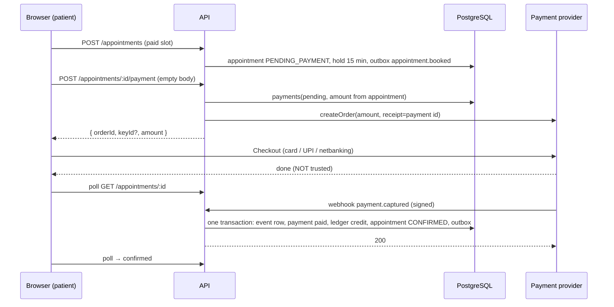
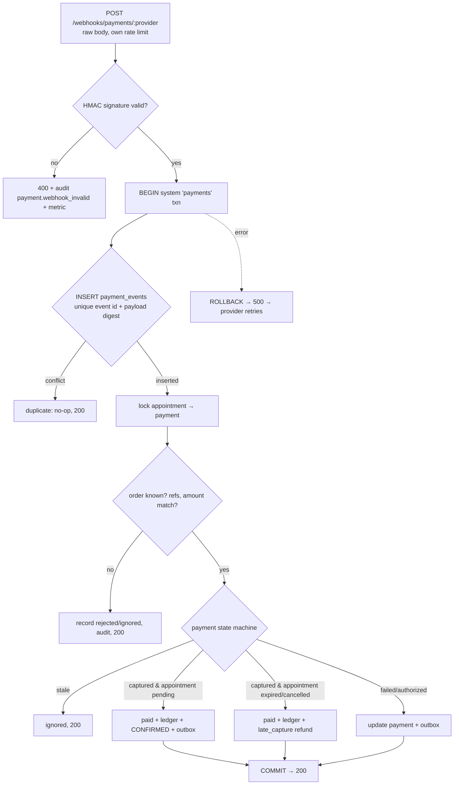
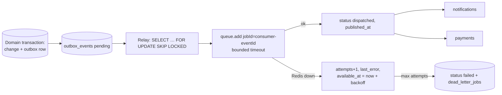
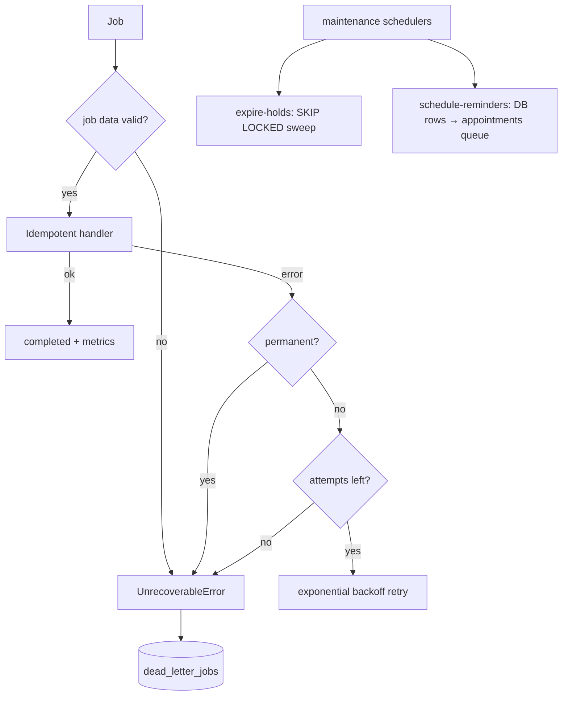

# ADR-0020: Payments, webhook authority, outbox relay, workers and notifications

- **Status:** Accepted
- **Date:** 2026-10-02
- **Refines:** ADR-0005 (outbox), ADR-0007 (provider abstractions), ADR-0019 (payment holds)

## Context

M3 creates paid bookings as `PENDING_PAYMENT` with a 15-minute hold, and it writes outbox
events in the same transaction as each change. M4 needs the following:

- Payments that are never confirmed by the browser.
- Webhooks that can be retried and replayed.
- An append-only financial record.
- Delivery of the outbox to background workers.
- Hold expiry that races payment confirmation safely.
- Reminders and notifications that tolerate duplicate delivery.

Redis must not become a source of truth.

## Decision

### 1. Provider abstraction

`PaymentProvider` has these operations:

- `createOrder`
- `verifyWebhook` (it returns a provider-neutral `ProviderEvent`)
- `refund`
- `getPaymentStatus`
- `checkoutOptions` (public browser data only)

There are two adapters:

- **`RazorpayPaymentProvider`** uses the REST API through `fetch` with timeouts. Orders use
  automatic capture. Refunds are made idempotent by first looking up a refund that
  carries our refund ID.
- **`FakePaymentProvider`** is deterministic and offline. It speaks Razorpay's webhook wire
  format, signed with the configured secret, so verification and processing run the same
  code as production.

Configuration rules:

- `PAYMENT_PROVIDER` selects the adapter.
- `fake` is refused in production.
- Live Razorpay keys are refused outside production.
- Production refuses non-live keys.

Provider failures map to these kinds, each marked retryable or not:

| Kind | Retryable |
|---|---|
| `timeout` | yes |
| `unavailable` (network, 5xx, 429) | yes |
| `invalid_response` | yes |
| `rejected` (4xx) | no |

`NotificationProvider` has these operations:

- `sendEmail`
- `sendSMS`
- `sendAppointmentReminder`
- `sendPaymentConfirmation`

Its adapters are a fake (in-memory) provider and SMTP (Mailpit locally). SMS is recorded
by the fake only, so development incurs no costs.

### 2. The webhook is the only authority

**A payment becomes `paid` only from a verified provider webhook.** The flow is:

1. Checkout creates the order server-side. The amount comes from the appointment row
   written at booking (the fee comes from the availability rule), never from the client.
   The checkout request body must be empty.
2. The browser receives only `{ provider, keyId?, orderId, amount, currency }`. After paying,
   it polls the appointment.
3. `POST /api/v1/webhooks/payments/:provider`:
   - It is mounted before the JSON parser and the global rate limiter.
   - It reads the raw body and has its own rate limit.
   - It has no user authentication.
   - It verifies an HMAC-SHA256 signature over the raw body.
4. The verified event is inserted into `payment_events`, together with its effects, in one
   transaction.
   - `UNIQUE (provider, provider_event_id)` and `UNIQUE (provider, payload_sha256)` make
     redelivery a no-op. Razorpay's event-ID header is not signed, so the digest also
     catches a signed body replayed under a new ID.
   - If processing fails, nothing is committed and the provider's retry starts over.
5. Rejected events are recorded and answered with 200, because retrying cannot help.
   Rejections include:
   - an unknown order;
   - an amount or currency mismatch;
   - a wrong appointment or payment reference;
   - a provider payment ID already attached to another payment.
6. Only invalid signatures and malformed bodies get a 400.

A development-only simulated checkout (`/appointments/:id/payment/simulate`) is available
only with the fake provider outside production. It builds a signed webhook and submits it
through the same verification and processing path.

### 3. Payment state machine

- `pending → authorized → paid → partially_refunded → refunded`
- `failed`: the patient may retry on the same order while the hold lasts.
- `cancelled`: the hold expired or the appointment was cancelled.

Events never move a payment backwards. A stale event is recorded as `ignored/stale_*`.

The one exception is a **late capture**: a provider-confirmed capture on a `cancelled`
payment becomes `paid`, and a full refund is requested automatically.

The appointment transitions `confirm_payment` and `expire` are **system-only** actions of
the existing M3 state machine. Payment code never writes an appointment status directly.

### 4. Concurrency

The hold sweeper and the webhook both lock the **appointment row first**. The lock order
is always appointment → payment → refund. The sweeper claims rows with
`FOR UPDATE SKIP LOCKED`. Whichever commits first decides, and the result is always one
of two valid states:

- **The webhook wins:** `confirmed` + `paid`. The sweeper skips the row.
- **Expiry wins:** `expired` + `paid` + a `late_capture` refund.

A capture never confirms an expired appointment, and no slot is double-booked. While the
row is still `pending_payment`, no other booking can hold the slot, because the M3
EXCLUDE constraint still applies.

### 5. Ledger and refunds

`ledger_entries` is append-only:

- the app role has no UPDATE or DELETE privilege;
- a trigger rejects UPDATE, DELETE and TRUNCATE for every role.

Entries record captures (credit) and processed refunds (debit). Corrections are
compensating `adjustment` entries. Unique partial indexes allow one capture per payment
and one entry per refund.

Refunds have these properties:

- Each refund row has an idempotency key:
  - `cancel-<appointment>` for cancellations;
  - `late-capture-<payment>` for late captures;
  - a hashed client key for manual refunds.
- The total refunded is capped at the amount paid, checked under the payment row lock.
- The provider call happens outside any transaction.
- Only the provider's `refund.processed` webhook writes the debit.

Refund policy:

- Cancellation by the doctor, the clinic or the system, or a reschedule: full refund.
- Cancellation by the patient at least 24 hours before the start: full refund.
- Later cancellation by the patient: no refund.

### 6. Transactional outbox relay

The relay runs in the worker process:

1. Claim a batch with `SELECT … FOR UPDATE SKIP LOCKED`.
2. Publish each event to every consuming queue with job ID `<consumer>-<eventId>`.
3. Mark the event `dispatched`, all in one transaction.

What this guarantees:

- **Crash before commit:** the event stays `pending` and is republished. This is
  at-least-once delivery, and BullMQ ignores the repeated job ID.
- **Redis unreachable:** publishing is bounded by a timeout. The event keeps attempts,
  `last_error` and an exponential `available_at`. After `OUTBOX_MAX_ATTEMPTS` it is marked
  `failed` and dead-lettered.
- **Events are never deleted by the relay.**

### 7. Workers

There are four queues:

| Queue | Work |
|---|---|
| `notifications` | Outbox events that notify people |
| `payments` | Close or refund on cancellation or expiry; execute refunds |
| `appointments` | Reminders |
| `maintenance` | Hold sweep and reminder sweep, run by BullMQ job schedulers |

Every handler is idempotent:

- Notification deliveries have a unique dedupe key and are row-locked while sending.
- Refunds use idempotency keys and run only from `pending`.
- Closing a payment is a state check.
- Reminders are rows in `appointment_reminders`.

Retries use exponential backoff and bounded attempts. Permanent errors skip retries:

- invalid job data;
- 4xx application errors;
- non-retryable provider errors.

A job that is permanently failing or has exhausted its attempts is written to
`dead_letter_jobs` in PostgreSQL. The row holds identifiers and a bounded failure reason.
`operations:manage` (platform admin) can inspect and retry dead letters.

Graceful shutdown follows this order:

1. Stop the relay (the in-flight batch commits or rolls back).
2. Close the workers (active jobs finish).
3. Close the queues.
4. Close Redis.
5. Close the database.

### 8. Reminders

The database is the source of truth. A sweep inserts due reminder rows with
`UNIQUE (appointment, offset, occurrence_starts_at)`:

- Offsets come from configuration; the defaults are 24 hours and 1 hour.
- Only the nearest due offset is inserted, and only if the appointment was confirmed
  before the reminder time.
- Rows that are still pending are re-enqueued after 5 minutes, which recovers jobs lost
  in a Redis restart.

Before sending, a reminder re-checks that the appointment is still `confirmed` at the same
start time. Cancelled or rescheduled appointments are skipped. A rescheduled appointment
is a new appointment and gets its own reminders.

### 9. System database context

Webhooks and workers have no user, so `withSystem(purpose)` sets a transaction-local
`app.system_purpose`. `authz.system_purpose()` returns NULL whenever `app.user_id` is
set, so a user transaction can never borrow system privileges. RLS grants each purpose
only what it needs:

| Purpose | Access |
|---|---|
| `payments` | Payment tables, ledger, appointment confirm and expire |
| `scheduler` | Appointments (read and expire), reminders |
| `notifications` | Delivery log, reminders, appointment read, `authz.notification_recipients()` |

`authz.notification_recipients()` returns contacts only.

## Diagrams

### Payment flow



### Webhook flow



### Outbox flow



### Worker flow



### Notification flow

```mermaid
sequenceDiagram
  participant Q as notifications / appointments queue
  participant N as Notification service
  participant DB as PostgreSQL
  participant NP as NotificationProvider
  Q->>N: { eventId, eventType, ids } or { reminderId }
  N->>DB: system 'notifications' txn: appointment schedule, doctor/clinic, recipients()
  N->>DB: INSERT delivery(dedupe_key) ON CONFLICT DO NOTHING; SELECT … FOR UPDATE
  alt already sent
    N-->>Q: duplicate (no-op)
  else
    N->>NP: send (template: schedule and payment info only)
    N->>DB: delivery sent
  end
```

## Consequences

- No frontend path can mark anything paid. Duplicate or replayed webhooks have one effect.
  Financial history is append-only.
- A Redis outage delays notifications and refunds but loses nothing. Correctness never
  depends on Redis.
- Delivery is at-least-once. An email could be resent only if a crash happens after the
  provider accepted the message and before the delivery row commits.
- A captured payment whose hold expired is refunded, not honoured.
- Refunds for rescheduled paid appointments are full, and the new booking must be paid
  again. Carrying a payment over is a later improvement.
- Integration tests must not run while a worker is attached to the same database. The
  harness detects the worker's Redis heartbeat and refuses to run.

## Alternatives considered

- **Trust the Checkout handler's signature (`razorpay_signature`) for confirmation:**
  rejected. The handler runs in the browser, and the webhook is the authority.
- **Delayed BullMQ jobs as the reminder schedule:** rejected. Redis would become the source
  of truth, and cancellations would need job removal.
- **Exactly-once delivery:** unnecessary with idempotent consumers, and impossible across
  PostgreSQL and Redis without two-phase commit.
- **A separate `BYPASSRLS` worker role:** rejected in favour of purpose-scoped system
  policies, which keep least privilege per kind of work.
