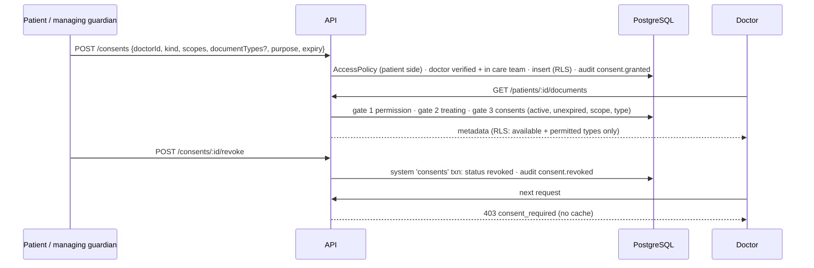
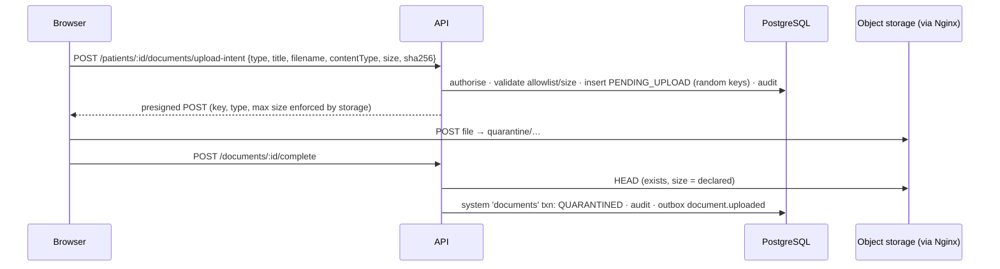
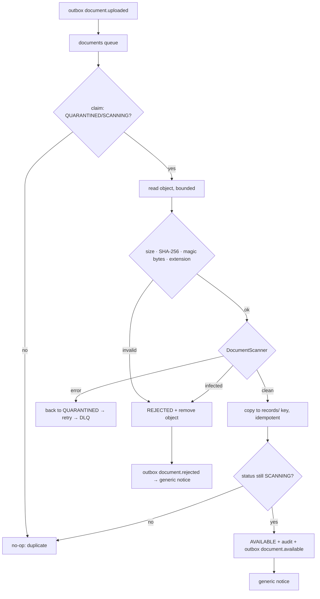
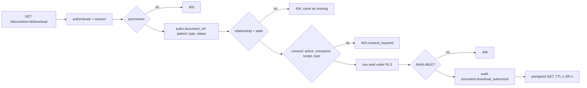

# ADR-0021: Consent, medical documents and secure access

- **Status:** Accepted
- **Date:** 2026-10-02
- **Refines:** ADR-0006 (layered access control), ADR-0013 (object storage), ADR-0017
  (interim consent basis)

## Context

Before any AI may process medical records (M6+), storing, accessing and auditing them
must be demonstrably correct. Several things need to be true:

- Access to a patient's record needs an explicit, revocable, expiring permission from the
  patient or a managing guardian.
- Uploaded files must be checked before anyone can open them.
- Object storage must never become an authorisation bypass.

## Decision

### 1. Consent model (`consents`)

A consent is a lifecycle, not a boolean. It contains:

| Field | Values |
|---|---|
| Grantee | A doctor (user + doctor profile) |
| Granted by | The patient (`patient_self`) or a managing guardian (`guardian`) |
| Kind | `manual` (ongoing, 1–365 days) or `appointment` (tied to one appointment) |
| Scopes (explicit) | `patient_profile`, `medical_documents`, `medical_documents_upload` |
| Document types | Optional filter |
| Purpose | `consultation`, `ongoing_care`, `second_opinion`, `follow_up` |
| Expiry | Always set |
| Status | `active`, `revoked` or `expired` |

Expiry details:

- An appointment consent lasts until 72 hours after the consultation ends.
- An elapsed consent is **expired at request time**. The housekeeping job only records the
  `expired` status and the `consent.expired` audit row.

Who may do what:

- Only the patient side can create or revoke consents. View-only guardians cannot.
- Consent can be granted only to a verified doctor in the patient's care team. Revocation
  takes effect on the next request.
- Users can INSERT consent rows (RLS checks the grantor), but never UPDATE them.
  Revocation and expiry are backend-controlled `consents` system transactions.

### 2. Request-time enforcement in AccessPolicy

Every patient-data request passes the existing gates plus resource scope and state:

| Gate | Check |
|---|---|
| 1. Permission | `medical_records:read` / `:write`, `consents:*` or `access_log:read` |
| 2. Relationship | Patient side, or treating doctor. Resource state is part of the relationship: other parties never relate to a document that is not `available`, and clinic membership never relates anyone to a document |
| 3. Consent | The consent resolver queries `consents` on every request (no cache) for an active, unexpired consent with the right scope, covering the document type, whose appointment still stands |
| Database | RLS repeats the check independently through `authz.has_consent()` |

The interim M2 basis (an active care relationship) now covers **only the patient
profile**, kept for backward compatibility: doctors' schedules show patient names. It
never extends to medical records. A doctor is never authorised merely for being:

- a doctor;
- a previous treating doctor;
- a member of the same clinic;
- a clinic or platform admin;
- the doctor on an existing appointment.

### 3. Document lifecycle (`medical_documents`; metadata only)

```
pending_upload ──complete──► quarantined ──claim──► scanning ──clean+valid──► available ──► retired
      │                           │                    │
      └──expired──► rejected ◄────┴──── infected / invalid ┘   scanning ──scanner error──► quarantined (retry)
```

Database protections:

- A trigger enforces the valid transitions.
- Identity columns are immutable for every role: patient, uploader, keys, declared
  type/size/checksum and document type.
- The app role has no DELETE privilege. Records are retired, never deleted.

Uploaders:

- the patient;
- a managing guardian;
- a treating doctor holding `medical_documents_upload` consent. The consent ID is
  recorded on the row. Upload scope is not read scope.

### 4. Storage: `DocumentStorage` over S3/MinIO

**Object keys** are generated by the server, random, and bound to the patient and document
by CHECK constraints:

- `quarantine/patients/{patientId}/documents/{documentId}/{random}`
- `records/patients/{patientId}/documents/{documentId}/{random}`

No filename or other user input ever reaches a key.

**Upload:** the API returns a presigned **POST** for the quarantine key. The storage
service itself enforces:

- the exact key;
- the content type;
- `content-length-range` (at most the declared size and at most `DOCUMENT_MAX_BYTES`).

Files never pass through the API.

**Download:** after authorisation, the API returns a presigned **GET**:

- TTL `DOCUMENT_DOWNLOAD_URL_TTL_SECONDS` (default 60 s, maximum 300 s);
- `Content-Disposition: attachment` with a sanitised filename;
- the detected content type;
- `Cache-Control: no-store`.

The URL is not the authorisation: it carries a decision already made, for its short life.

**Browser origin:** browsers reach storage through Nginx (`/healthbridge-documents/…`,
GET/HEAD/POST only), which proxies over a dedicated `storage` network. MinIO stays off the
edge network. Signing uses `S3_PUBLIC_ENDPOINT`.

### 5. Scanning and promotion

The `documents` worker, fed by the outbox event `document.uploaded`, does this:

1. Claims the document (`scanning`) under a row lock.
2. Reads the object (bounded).
3. Validates size, SHA-256 and magic bytes against the declared type and extension. The
   allowlist is PDF, PNG and JPEG.
4. Scans with `DocumentScanner`:
   - ClamAV (`clamd` INSTREAM) for real use;
   - a deterministic fake for development and tests, which recognises EICAR and a failure
     marker. It is **not protection** and is refused in staging and production.
5. Handles the result:
   - **Clean:** promotion is an idempotent copy to the `records/` key, then an atomic
     status flip that re-checks `scanning` under the lock.
   - **Infected or invalid:** the document is rejected and the object removed.
   - **Scanner error:** the document goes back to `quarantined`, the job is retried, and
     after the last attempt it is dead-lettered. It never becomes available.

Duplicate jobs and crashes between the copy and the commit converge on one promotion.

### 6. Patient access log

The log is built on the existing append-only `audit.audit_logs` table, not a second audit
system. Audit rows carry structured actions (`consent.*`, `document.*` and doctors'
`patients:read`). The API turns them into plain-language entries.

Never exposed:

- IP addresses, user agents, request or session IDs;
- database IDs;
- raw metadata.

Accounts with no relationship to the patient appear anonymously.

## Diagrams

### Consent flow



### Document upload flow



### Scanning and promotion flow



### Document access flow



## Consequences

- **Revocation stops new access immediately.** A presigned URL issued before revocation
  stays usable until its TTL (default 60 s), because object storage cannot recall a
  signature it has already issued. Hence the short TTLs, and new URLs are refused. See
  SECURITY.md.
- **Metadata existence:** the classification function lets the API tell a treating doctor
  "consent required" (403). Anyone unrelated gets the same 404 as for a missing document.
- **Retention and lifecycle:**
  - Retired documents and their objects are retained (versioned bucket).
  - Rejected objects are deleted.
  - Quarantine objects from abandoned intents need a bucket lifecycle rule in production.
- **Development scanning:** the fake scanner makes development and tests deterministic.
  Real scanning requires ClamAV (`--profile scanner`) and is mandatory outside
  development and test.

## Alternatives considered

- **Upload through the API:** rejected. It puts large bodies and malware-handling code on
  the request path; presigned POST with storage-enforced conditions is narrower.
- **A consent cache:** rejected. It would let revoked access survive; per-request lookups
  are cheap and indexed.
- **A separate access-log table:** rejected. A second trail could diverge from the
  append-only audit record.
- **Presigned PUT:** rejected. It cannot enforce a maximum size; POST policies can.
